<!-- OPENSPEC:START -->
# OpenSpec Instructions

These instructions are for AI assistants working in this project.

Always open `@/openspec/AGENTS.md` when the request:
- Mentions planning or proposals (words like proposal, spec, change, plan)
- Introduces new capabilities, breaking changes, architecture shifts, or big performance/security work
- Sounds ambiguous and you need the authoritative spec before coding

Use `@/openspec/AGENTS.md` to learn:
- How to create and apply change proposals
- Spec format and conventions
- Project structure and guidelines

Keep this managed block so 'openspec update' can refresh the instructions.

<!-- OPENSPEC:END -->

# Agent Operating Rules
- Do thinking/planning/coding in English; provide final user-facing replies in Chinese.
- Use the GitHub CLI (`gh`) for GitHub workflows (issues/PRs/checks) whenever possible.
- `adb logcat` can be noisy: do not dump full logs; filter to only what is needed, and note that logs may contain other apps/system output.
- Prefer architectural and logical consistency over “minimal intrusion”; align with existing patterns even if it takes extra work to unify/abstract.
- Write Markdown documents in Chinese unless the task explicitly requests otherwise.

# Environment
- Windows 11 + WSL2.

# Repository Guidelines

## Project Structure & Module Organization
The app follows a modular MVVM layout. The composition root lives in `app/` (launcher shell + global wiring). Feature/business modules live in sibling directories (e.g. `anime_component/`, `local_component/`, `player_component/`, `storage_component/`, `user_component/`, `bilibili_component/`). Shared foundations are provided by `core_*` modules and `data_component/`. Build tooling resides in `buildSrc/`, and custom assets/scripts live under `document/`, `scripts/`, and `repository/`. Prefer keeping large media/prompts in dedicated folders rather than polluting module folders.

## Module Overview (based on `settings.gradle.kts`)
> Scope: only modules included via `include(...)` in `settings.gradle.kts`. The repo may contain similarly named folders that are not part of the main build.

- Total modules: `21` (`15` app/core/data + `6` bundled `repository` dependencies)
- App shell (1)
  - `:app`: app entry + shell (startup/main UI including TV), composes all modules into the final APK; also hosts global capabilities like Media3 sessions/background services.
- Feature/business modules (6)
  - `:anime_component`: anime/resource search, filters, details, follow/history (including magnet-search UI).
  - `:local_component`: local media library + playback entry; playback history; danmaku/subtitle source binding and downloads (e.g. Bilibili danmaku, Shooter subtitles).
  - `:player_component`: player capabilities + UI (Media3/VLC/mpv adapters, subtitles/ASS rendering, danmaku rendering/filtering, TV/gesture controls, caching, etc.).
  - `:storage_component`: storage + “streaming/casting” UI (file browsing, remote storage config, QR/remote scan, casting provider/receiver, etc.).
  - `:user_component`: user center + settings (login/profile, theme, player/app/developer settings, cache/scan management, about/licenses, etc.).
  - `:bilibili_component`: Bilibili integration (auth/cookies, signing, playback links/MPD, danmaku download, live danmaku socket, playback heartbeat + risk-control state), reused across modules.
- Core foundation modules (7)
  - `:core_contract_component`: cross-module contracts + routing (e.g. `RouteTable`), Service interfaces (file sharing/casting), playback extensions / shared Media3 session APIs.
  - `:core_system_component`: runtime/system integration (Application/startup orchestration, permissions/notifications/broadcasts, global config tables/tools, build-time injected keys/flags); may depend on `:core_log_component` to initialize logging/crash reporting early.
  - `:core_log_component`: logging + reporting infrastructure (collection/persistence, Bugly reporting, runtime log policy/sampling, subtitle/playback telemetry); initialized/wired by runtime; does not depend on `:core_system_component`.
  - `:core_network_component`: network foundations (Retrofit + Moshi, request wrappers/interceptors, shared Service/Repository plumbing).
  - `:core_database_component`: database layer (Room database management, DAO, migrations, selected local stores).
  - `:core_storage_component`: storage abstraction + implementations (multi-protocol/multi-source storage, media parsing/play proxy, danmaku/subtitle lookup, 7zip extraction, thunder download management, etc.).
  - `:core_ui_component`: shared UI foundations (BaseActivity/Fragment/ViewModel, adapters/paging, theme/focus policy, shared widgets/dialogs, etc.).
- Data model module (1)
  - `:data_component`: shared data layer (Room entities/converters, Moshi network models, business enums/parameter objects).
- Bundled repository dependency modules (6)
  - `:repository:danmaku`: wrapper for `DanmakuFlameMaster.aar` (danmaku rendering).
  - `:repository:immersion_bar`: wrapper for `immersionbar.aar` (immersive status bar).
  - `:repository:panel_switch`: wrapper for `panelSwitchHelper-androidx.aar` (panel/keyboard switch helper).
  - `:repository:seven_zip`: wrapper for `sevenzipjbinding4Android.aar` (7z extraction).
  - `:repository:thunder`: wrapper for `thunder.aar` (download-related).
  - `:repository:video_cache`: wrapper for `library-release.aar` (video caching).

## Module Dependency Layering Rules (based on current Gradle dependencies)
> Note: this is a reference for “layer semantics alignment + dependency governance”. The dependency snapshot is `document/architecture/module_dependencies_snapshot.md` (direct Gradle `project(...)` edges). Governance rules live in `document/architecture/module_dependency_governance.md` (includes DR-0001: treat `system` as runtime; allow `system -> log`).

**Design Principles**
- One-way dependencies, no cycles (dependencies only flow from “higher-level features” to “lower-level infra/contracts/data”).
- `core_*` provides reusable capabilities and must not depend on any feature module.
- Feature modules must not depend on each other (cross-feature collaboration must go through `:core_contract_component` contracts/interfaces + routing).
- `repository:*` is only for 2nd/3rd-party wrappers; depend on them directly where needed, avoid pulling them into `:app` without reason.

```mermaid
graph TD
  %% Convention: A --> B means A depends on B

  subgraph Repo["repository/* (bundled AAR dependencies)"]
    repo_danmaku[":repository:danmaku"]
    repo_immersion[":repository:immersion_bar"]
    repo_panel[":repository:panel_switch"]
    repo_seven[":repository:seven_zip"]
    repo_thunder[":repository:thunder"]
    repo_cache[":repository:video_cache"]
  end

  subgraph Base["Base layer (data/contracts only)"]
    data[":data_component"]
    contract[":core_contract_component"]
  end

  subgraph Runtime["Runtime layer"]
    system[":core_system_component"]
    log[":core_log_component"]
  end

  subgraph Infra["Infrastructure layer (replaceable implementations)"]
    network[":core_network_component"]
    db[":core_database_component"]
    bilibili[":bilibili_component"]
    storageCore[":core_storage_component"]
  end

  subgraph UI["UI foundation layer"]
    uiCore[":core_ui_component"]
  end

  subgraph Feature["Feature layer"]
    anime[":anime_component"]
    local[":local_component"]
    user[":user_component"]
    player[":player_component"]
    storageFeature[":storage_component"]
  end

  app[":app (composition root / shell)"]

  contract --> data
  system --> contract
  system --> data

  log --> data
  system --> log

  network --> system
  network --> log
  network --> data

  db --> system
  db --> data

  bilibili --> network
  bilibili --> db
  bilibili --> system
  bilibili --> log
  bilibili --> contract
  bilibili --> data

  storageCore --> contract
  storageCore --> network
  storageCore --> db
  storageCore --> system
  storageCore --> log
  storageCore --> data
  storageCore --> bilibili
  storageCore --> repo_seven
  storageCore --> repo_thunder

  uiCore --> system
  uiCore --> log
  uiCore --> contract
  uiCore --> data
  uiCore --> repo_immersion

  anime --> uiCore
  anime --> system
  anime --> log
  anime --> network
  anime --> db
  anime --> storageCore
  anime --> contract
  anime --> data

  local --> uiCore
  local --> system
  local --> log
  local --> network
  local --> storageCore
  local --> db
  local --> bilibili
  local --> contract
  local --> data

  user --> uiCore
  user --> system
  user --> log
  user --> network
  user --> db
  user --> storageCore
  user --> bilibili
  user --> contract
  user --> data

  player --> uiCore
  player --> system
  player --> log
  player --> storageCore
  player --> network
  player --> db
  player --> contract
  player --> data
  player --> repo_danmaku
  player --> repo_panel
  player --> repo_cache

  storageFeature --> uiCore
  storageFeature --> system
  storageFeature --> log
  storageFeature --> network
  storageFeature --> db
  storageFeature --> storageCore
  storageFeature --> bilibili
  storageFeature --> contract
  storageFeature --> data

  app --> anime
  app --> local
  app --> user
  app --> player
  app --> storageFeature
  app --> system
  app --> log
  app --> network
  app --> db
  app --> uiCore
  app --> contract
  app --> data
```

## Build, Test, and Development Commands
Use Gradle from repo root:
- `./gradlew assembleDebug` – fast developer build with logging enabled.
- `./gradlew assembleRelease` – optimized, signed release artifacts.
- `./gradlew clean build` – full rebuild to validate cross-module wiring.
- `./gradlew dependencyUpdates` – report outdated libraries defined in `build.gradle.kts`.
- `./gradlew verifyModuleDependencies` – module dependency governance check (v2), verifies direct `project(...)` dependencies against the allowed matrix/whitelist.
- `./gradlew testDebugUnitTest` and `./gradlew connectedDebugAndroidTest` – run JVM unit tests and device/emulator instrumentation respectively.

### Build Verification Requirement
- Always read the tail of Gradle output and confirm whether it ends with `BUILD SUCCESSFUL` or `BUILD FAILED` before reporting status to the user. Do **not** assume success just because tasks ran; explicitly mention failures when they occur.

## Coding Style & Naming Conventions
Stick to the Kotlin version configured by the repo (currently 1.9.25), with 4-space indentation, explicit visibility, and trailing commas disabled. View models live under `.../presentation` or `.../viewmodel` packages; fragments/activities use DataBinding layouts named `fragment_<feature>.xml` or `activity_<feature>.xml`. ARouter paths follow `/module/Feature`. Prefer extension functions for shared logic and keep shared helpers in appropriate `core_*` modules (often under `com.xyoye.common_component.*` packages), instead of duplicating them in feature modules. Lint via `./gradlew lint` before sending patches and let ktlint/Detekt settings inside `buildSrc` drive formatting rather than ad-hoc style tweaks.

## Testing Guidelines
Place JVM tests in `*/src/test/java` and instrumentation suites in `*/src/androidTest/java`; name files `<Class>Test.kt` or `<Feature>InstrumentedTest.kt` so Gradle discovers them. Cover parsing, player helpers, and data-layer conversions with unit tests, and reserve playback/integration flows for instrumentation backed by an emulator with media files in `storage_component`. Failing tests should block the PR, so run `testDebugUnitTest` locally and attach emulator logs when `connectedDebugAndroidTest` fails.

## Commit & Pull Request Guidelines
Recent history uses the `<type>: 
` pattern (`fix: ...`, `refactor: ...`); keep summaries under ~60 characters and describe scope (e.g., `player_component`). Squash noisy WIP commits before pushing. PRs must include: purpose, affected modules, test evidence (command + result), and UI screenshots when touching layouts. Link GitHub issues and note any required configuration toggles (`IS_APPLICATION_RUN`, `IS_DEBUG_MODE`).

## Security & Configuration Tips
Sensitive tokens belong in `local.properties` or Gradle properties; never hard-code keys. Toggle `IS_DEBUG_MODE` and `IS_APPLICATION_RUN` in `gradle.properties` when enabling verbose logs or single-module runs, then rebuild so the flags propagate. Follow `BUGLY_CONFIG.md` for crash reporting credentials, and remember the `user_component` ships with remote APIs disabled—avoid re-enabling interfaces without coordinator approval to keep builds distributable.

## Recent Changes
- 001-115-open-storage: Added Kotlin 1.9.25 (JVM target 1.8), Android Gradle Plugin 8.7.2 + AndroidX, Kotlin Coroutines, Retrofit + OkHttp, Moshi, Room, MMKV, Media3, NanoHTTPD (local proxy), ARouter.
- 001-baidu-pan-storage: Added Kotlin 1.9.25 (JVM target 1.8), Android Gradle Plugin 8.7.2 + AndroidX, Kotlin Coroutines, Retrofit + OkHttp, Moshi, Room, MMKV, Media3, NanoHTTPD (local proxy), ARouter.

## TV/Remote UX
- When adjusting UI element logic (focus/order/visibility), always consider Android TV remote navigation: ensure DPAD can reach/give feedback for all controls and verify focus loops are reachable on TV.

## Active Technologies
- Kotlin 1.9.25 (JVM target 1.8), Android Gradle Plugin 8.7.2 + AndroidX (Lifecycle/ViewModel/Room, etc.), Kotlin Coroutines, Retrofit/OkHttp, Moshi, Media3, ARouter, MMKV (003-add-bilibili-history)
- Room (SQLite) + MMKV (Key-Value) + local cache files (for temporary MPD/QR images, etc.) (003-add-bilibili-history)
- Kotlin 1.9.25 (JVM target 1.8), Android Gradle Plugin 8.7.2 + AndroidX, Kotlin Coroutines, Retrofit + OkHttp, Moshi, Room, MMKV, Media3, NanoHTTPD (local proxy), ARouter (001-baidu-pan-storage)
- Room (tables like `media_library`) + MMKV (preferences/login state storage) + local cache files (subtitles/danmaku/temporary manifests, etc.) (001-baidu-pan-storage)
- Room (tables like `media_library`) + MMKV (preferences/authorization-isolated storage) + local cache files (subtitles/danmaku/temporary manifests, etc.) (001-115-open-storage)
