# Repository Guidelines

## Project Structure & Module Organization
The app follows a modular MVVM layout: `app/` hosts the launcher shell, shared UI glue, and manifest; feature slices live in sibling directories (`anime_component/`, `player_component/`, `local_component/`, `storage_component/`, `stream_component/`, `user_component/`, `download_component/`). Foundation logic is centralized in `common_component/` (base classes, utilities) and `data_component/` (entities, repositories). Build tooling resides in `buildSrc/` and custom assets/scripts live under `document/`, `scripts/`, and `repository/`. Keep media or prompts within `Img/` or `prompts/` instead of polluting module folders.

## 组件大类与用途（以 `settings.gradle.kts` 为准）
> 统计口径：仅包含 `settings.gradle.kts` 里 `include(...)` 的模块；仓库里可能还有同名目录但未被纳入当前主工程构建。

- 总模块数：`21`（主业务/核心/数据 `15` + `repository` 内置依赖 `6`）
- 入口壳（1）
  - `:app`：应用入口与壳层（启动/主界面含 TV），并负责把各组件组装成最终 APK；同时承载 Media3 会话/后台服务等全局能力。
- 业务功能组件（6）
  - `:anime_component`：番剧/资源搜索、筛选、详情、追番、历史等（含磁力搜索相关界面）。
  - `:local_component`：本地媒体库与播放入口；播放历史；弹幕/字幕来源绑定与下载（如 B 站弹幕、Shooter 字幕等）。
  - `:player_component`：播放器能力与 UI（Media3/VLC/mpv 内核适配、字幕/ASS 渲染、弹幕渲染与过滤、TV/手势控制、缓存等）。
  - `:storage_component`：存储与“串流/投屏”业务 UI（文件浏览、远程存储配置、扫码/远程扫描、投屏提供与接收等）。
  - `:user_component`：用户中心与设置（登录/用户信息、主题、播放器/应用/开发者设置、缓存与扫描管理、关于/许可等）。
  - `:bilibili_component`：B 站能力适配（鉴权/Cookie、签名、播放链接/MPD、弹幕下载、直播弹幕 socket、播放心跳与风控态等），供多模块复用。
- 核心基础组件（7）
  - `:core_contract_component`：跨模块契约与路由（如 `RouteTable`）、Service 接口（存储文件共享/投屏等）、播放扩展/Media3 会话公共 API。
  - `:core_system_component`：运行时（runtime）与系统能力整合（Application/启动编排、权限/通知/广播、全局配置表与工具、构建期注入密钥/开关等；允许依赖 `:core_log_component` 以完成“尽早初始化日志/崩溃上报链路”）。
  - `:core_log_component`：日志与上报基础设施（日志采集/落盘、Bugly 上报、运行态日志策略/采样、字幕/播放遥测等；由 runtime 负责初始化与装配，`core_log_component` 本身不依赖 `core_system_component`）。
  - `:core_network_component`：网络层基础（Retrofit+Moshi、请求封装与拦截器体系、各业务 Service/Repository）。
  - `:core_database_component`：数据库层（Room 数据库管理、DAO、迁移、部分本地 Store）。
  - `:core_storage_component`：存储抽象与实现（多协议/多来源 Storage、媒体解析/播放代理、弹幕/字幕查找、7zip 解压、thunder 下载管理等）。
  - `:core_ui_component`：通用 UI 基建（BaseActivity/Fragment/ViewModel、Adapter/分页、主题/焦点策略、公共控件/对话框等）。
- 数据模型组件（1）
  - `:data_component`：共享数据层（Room Entity/Converter、网络模型 Moshi、业务枚举/参数对象）。
- 内置仓库依赖模块（6）
  - `:repository:danmaku`：`DanmakuFlameMaster.aar` 弹幕渲染库封装。
  - `:repository:immersion_bar`：`immersionbar.aar` 沉浸式状态栏库封装。
  - `:repository:panel_switch`：`panelSwitchHelper-androidx.aar` 面板/键盘切换库封装。
  - `:repository:seven_zip`：`sevenzipjbinding4Android.aar` 7z 解压库封装。
  - `:repository:thunder`：`thunder.aar` 下载相关库封装。
  - `:repository:video_cache`：`library-release.aar` 视频缓存库封装。

## 模块依赖分层规则（基于当前 Gradle 依赖）
> 说明：用于“分层语义对齐 + 依赖治理”参考；边关系以 `document/architecture/module_dependencies_snapshot.md`（Gradle `project(...)` 直接依赖快照）为准；分层语义与治理规则以 `document/architecture/module_dependency_governance.md` 为准（含 DR-0001：system 视为 runtime，允许 `system -> log`）。

**设计原则**
- 单向依赖、无环（依赖只允许从“上层业务”指向“下层基础设施/契约/数据”）。
- `core_*` 只提供可复用能力，不反向依赖任何业务功能模块。
- 业务功能模块之间禁止互相依赖（跨业务协作通过 `core_contract_component` 的契约/接口 + 路由完成）。
- `repository:*` 仅作为二/三方封装，被需要的模块直接依赖，避免 `app` 无意义引入。

```mermaid
graph TD
  %% 约定：A --> B 表示 A 依赖 B

  subgraph Repo["repository/*（内置 AAR 依赖）"]
    repo_danmaku[":repository:danmaku"]
    repo_immersion[":repository:immersion_bar"]
    repo_panel[":repository:panel_switch"]
    repo_seven[":repository:seven_zip"]
    repo_thunder[":repository:thunder"]
    repo_cache[":repository:video_cache"]
  end

  subgraph Base["基础层（纯数据/契约）"]
    data[":data_component"]
    contract[":core_contract_component"]
  end

  subgraph Runtime["运行时层（runtime）"]
    system[":core_system_component"]
    log[":core_log_component"]
  end

  subgraph Infra["基础设施层（可替换实现）"]
    network[":core_network_component"]
    db[":core_database_component"]
    bilibili[":bilibili_component"]
    storageCore[":core_storage_component"]
  end

  subgraph UI["UI 基建层"]
    uiCore[":core_ui_component"]
  end

  subgraph Feature["业务功能层"]
    anime[":anime_component"]
    local[":local_component"]
    user[":user_component"]
    player[":player_component"]
    storageFeature[":storage_component"]
  end

  app[":app（组合根/壳）"]

  contract --> data
  system --> contract
  system --> data

  log --> data
  system --> log

  network --> system
  network --> log
  network --> data

  db --> system
  db --> data

  bilibili --> network
  bilibili --> db
  bilibili --> system
  bilibili --> log
  bilibili --> contract
  bilibili --> data

  storageCore --> contract
  storageCore --> network
  storageCore --> db
  storageCore --> system
  storageCore --> log
  storageCore --> data
  storageCore --> bilibili
  storageCore --> repo_seven
  storageCore --> repo_thunder

  uiCore --> system
  uiCore --> log
  uiCore --> contract
  uiCore --> data
  uiCore --> repo_immersion

  anime --> uiCore
  anime --> system
  anime --> log
  anime --> network
  anime --> db
  anime --> storageCore
  anime --> contract
  anime --> data

  local --> uiCore
  local --> system
  local --> log
  local --> network
  local --> storageCore
  local --> db
  local --> bilibili
  local --> contract
  local --> data

  user --> uiCore
  user --> system
  user --> log
  user --> network
  user --> db
  user --> storageCore
  user --> bilibili
  user --> contract
  user --> data

  player --> uiCore
  player --> system
  player --> log
  player --> storageCore
  player --> network
  player --> db
  player --> contract
  player --> data
  player --> repo_danmaku
  player --> repo_panel
  player --> repo_cache

  storageFeature --> uiCore
  storageFeature --> system
  storageFeature --> log
  storageFeature --> network
  storageFeature --> db
  storageFeature --> storageCore
  storageFeature --> bilibili
  storageFeature --> contract
  storageFeature --> data

  app --> anime
  app --> local
  app --> user
  app --> player
  app --> storageFeature
  app --> system
  app --> log
  app --> network
  app --> db
  app --> uiCore
  app --> contract
  app --> data
```

## Build, Test, and Development Commands
Use Gradle from repo root:
- `./gradlew assembleDebug` – fast developer build with logging enabled.
- `./gradlew assembleRelease` – optimized, signed release artifacts.
- `./gradlew clean build` – full rebuild to validate cross-module wiring.
- `./gradlew dependencyUpdates` – report outdated libraries defined in `build.gradle.kts`.
- `./gradlew verifyModuleDependencies` – 模块依赖治理校验（v2），检查 `project(...)` 直接依赖是否符合允许矩阵/白名单。
- `./gradlew testDebugUnitTest` and `./gradlew connectedDebugAndroidTest` – run JVM unit tests and device/emulator instrumentation respectively.

### Build Verification Requirement
- Always read the tail of Gradle output and confirm whether it ends with `BUILD SUCCESSFUL` or `BUILD FAILED` before reporting status to the user. Do **not** assume success just because tasks ran; explicitly mention failures when they occur.

## Coding Style & Naming Conventions
Stick to Kotlin 1.7.x with 4-space indentation, explicit visibility, and trailing commas disabled. View models live under `.../presentation` or `.../viewmodel` packages, fragments/activities use DataBinding layouts named `fragment_<feature>.xml` or `activity_<feature>.xml`. ARouter paths follow `/module/Feature`. Prefer extension functions for shared logic (place them in `common_component`). Lint via `./gradlew lint` before sending patches and let ktlint/Detekt settings inside `buildSrc` drive formatting rather than ad-hoc style tweaks.

## Testing Guidelines
Place JVM tests in `*/src/test/java` and instrumentation suites in `*/src/androidTest/java`; name files `<Class>Test.kt` or `<Feature>InstrumentedTest.kt` so Gradle discovers them. Cover parsing, player helpers, and data-layer conversions with unit tests, and reserve playback/integration flows for instrumentation backed by an emulator with media files in `storage_component`. Failing tests should block the PR, so run `testDebugUnitTest` locally and attach emulator logs when `connectedDebugAndroidTest` fails.

## Commit & Pull Request Guidelines
Recent history uses the `<type>: 
` pattern (`fix: ...`, `refactor: ...`); keep summaries under ~60 characters and describe scope (e.g., `player_component`). Squash noisy WIP commits before pushing. PRs must include: purpose, affected modules, test evidence (command + result), and UI screenshots when touching layouts. Link GitHub issues and note any required configuration toggles (`IS_APPLICATION_RUN`, `IS_DEBUG_MODE`).

## Security & Configuration Tips
Sensitive tokens belong in `local.properties` or Gradle properties; never hard-code keys. Toggle `IS_DEBUG_MODE` and `IS_APPLICATION_RUN` in `gradle.properties` when enabling verbose logs or single-module runs, then rebuild so the flags propagate. Follow `BUGLY_CONFIG.md` for crash reporting credentials, and remember the `user_component` ships with remote APIs disabled—avoid re-enabling interfaces without coordinator approval to keep builds distributable.

## Recent Changes
- 003-add-bilibili-history: Added Kotlin 1.9.25（JVM target 1.8），Android Gradle Plugin 8.7.2 + AndroidX（Lifecycle/ViewModel/Room 等）、Kotlin Coroutines、Retrofit/OkHttp、Moshi、Media3、ARouter、MMKV
- 001-migrate-media3: Added Kotlin 1.7.x with Java interoperability for existing Exo helper classes

## TV/Remote UX
- When adjusting UI element logic (focus/order/visibility), always consider Android TV remote navigation: ensure DPAD can reach/give feedback for all controls and verify focus loops are reachable on TV.

## Active Technologies
- Kotlin 1.9.25（JVM target 1.8），Android Gradle Plugin 8.7.2 + AndroidX（Lifecycle/ViewModel/Room 等）、Kotlin Coroutines、Retrofit/OkHttp、Moshi、Media3、ARouter、MMKV (003-add-bilibili-history)
- Room（SQLite）+ MMKV（Key-Value）+ 本地缓存文件（用于临时 mpd/二维码图片等） (003-add-bilibili-history)
