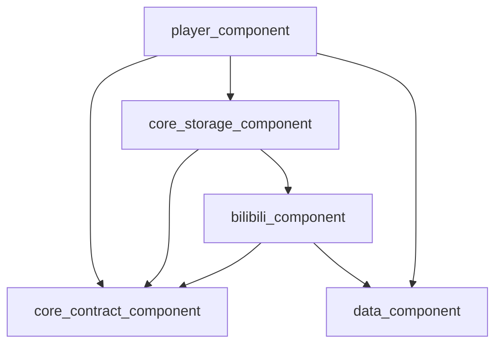
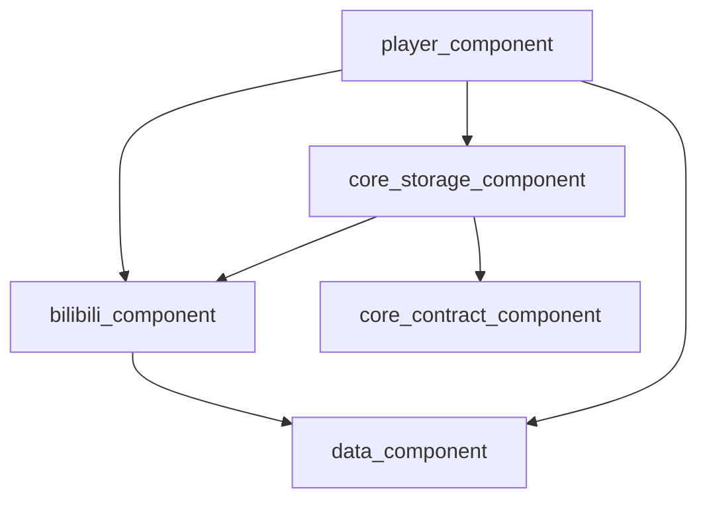

# 播放器内核模块与 Bilibili 存储库耦合分析（改造前现状与问题定位）

**文档状态**：归档（Archived，保留为“改造前问题定位”记录）  
**最后更新**：2026-01-09  
**现状说明**：已按 `TODOs/player_storage_playback_addon_design.md` 完成解耦（T-01 ~ T-12），本文下半部分的“耦合点/证据”用于说明为何需要解耦；与当前代码行号可能不一致。  
**适用范围**：`player_component` / `core_storage_component` / `bilibili_component` / `core_contract_component` / `data_component`  

---

## 0. 改造落地结果（已解耦后的现状）

- 播放器侧已引入 **Playback Addon** 机制：`player_component` 仅通过 `core_contract_component` 的 Contract 与存储扩展交互，不再依赖 `bilibili_component`。
- Contract：`core_contract_component/src/main/java/com/xyoye/common_component/playback/addon/*`
- Source 挂载：`core_storage_component/src/main/java/com/xyoye/common_component/source/base/BaseVideoSource.kt` 实现 `PlaybackAddonProvider`；`core_storage_component/src/main/java/com/xyoye/common_component/source/media/StorageVideoSource.kt` 为需要的来源创建 addon（B 站为 `BilibiliPlaybackAddon`）。
- 事件派发：
  - `player_component/src/main/java/com/xyoye/player/controller/base/BaseVideoController.kt` 派发 `PlaybackEvent.Progress/PlayStateChanged`
  - `player_component/src/main/java/com/xyoye/player_component/ui/activities/player/PlayerActivity.kt` 派发 `PlaybackEvent.SourceChanged/PlaybackError`，并通过 addon 可选能力完成“切换/恢复”
- Header/Referer：`core_contract_component/src/main/java/com/xyoye/common_component/storage/Storage.kt` 新增 `getNetworkHeaders(file)`；B 站 referer 注入迁回 `core_storage_component/src/main/java/com/xyoye/common_component/storage/impl/BilibiliStorage.kt`；`StorageVideoSource` 不再解析 `BilibiliKeys`。
- 设置系统：移除 `SettingViewType.BILIBILI_PLAYBACK`；新增 `SettingViewType.PLAYBACK_ADDON_SETTING` + `player_component/src/main/java/com/xyoye/player/controller/setting/SettingPlaybackAddonView.kt`（schema 渲染）。

### 0.1 改造后依赖关系（简化）

---

## 1. 背景与目标

当前工程采用“**播放器（多内核） + 存储库（多来源）**”的组合：

- **播放器应是通用能力**：对所有存储（本地、WebDav、SMB、Bilibili、…）统一提供播放、控制、轨道、字幕/弹幕等能力。
- **存储库应是适配层**：对上游接口/鉴权/参数/回退/心跳等进行适配，向播放器提供“可播放的 URL/清单 + 可选的播放期能力扩展”。

本分析文档聚焦：**当前 `player_component` 与 Bilibili 存储链路之间的耦合位置、耦合方式、带来的工程问题**，为后续“解耦设计与任务拆分”提供事实依据与改造优先级。

---

## 2. 术语与范围界定

### 2.1 术语

- **播放器内核/播放层**：此处包含 `player_component` 中的播放器壳（如 `DanDanVideoPlayer`）以及播放控制与编排（如 `BaseVideoController`、`PlayerActivity`）。
- **Bilibili 存储库**：此处包含：
  - `core_storage_component` 中的 `BilibiliStorage` / `BilibiliStorageFile`（把 B 站资源虚拟成目录/文件，并提供 `createPlayUrl`）。
  - `bilibili_component` 中的上游对接（`BilibiliRepository`、风险控制、Cookie、playurl、心跳等）。
- **耦合（Coupling）**：指模块间出现不必要的编译期依赖、类型依赖、控制流依赖、数据约定依赖、UI/功能枚举依赖等，导致边界不清、改动扩散、复用困难。

### 2.2 范围

- **包含**：与 Bilibili 播放链路相关的播放器侧调用、类型引用、事件分发、会话存储、设置 UI、Header/Referer 处理。
- **不包含**：Bilibili 上游接口正确性、取流策略优劣对比（该部分已有其他设计分析文档可参考）。

---

## 3. 模块依赖关系（现状）

### 3.1 编译期依赖图（简化）

**关键问题**：`player_component` 直接依赖 `bilibili_component`，使播放器模块在编译期就被绑定到某个具体存储/上游实现。

### 3.2 依赖证据（Gradle）

- `player_component/build.gradle.kts:154`：`implementation(project(":bilibili_component"))`
- `core_storage_component/build.gradle.kts:17`：`implementation(project(":bilibili_component"))`

> `core_storage_component -> bilibili_component` 是合理的（BilibiliStorage 需要上游适配）。  
> `player_component -> bilibili_component` 则意味着播放器对存储适配层产生“反向依赖”，是后续解耦的主要对象。

---

## 4. 耦合点清单（按类型拆解）

### 4.1 编译期耦合（Build-time）

| 耦合点 | 位置 | 说明 | 影响 |
|---|---|---|---|
| 播放器直接依赖 Bilibili 模块 | `player_component/build.gradle.kts:154` | 播放器编译期可直接引用 B 站类型与逻辑 | 破坏模块边界；任何 B 站改动可能影响播放器编译/发布；阻碍“播放器通用化” |

### 4.2 类型耦合（Type-level）

#### 4.2.1 播放控制基类内嵌 B 站心跳

- `player_component/src/main/java/com/xyoye/player/controller/base/BaseVideoController.kt:248` 直接调用 `BilibiliPlaybackHeartbeat.onPlayStateChanged(...)`
- `player_component/src/main/java/com/xyoye/player/controller/base/BaseVideoController.kt:353` 直接调用 `BilibiliPlaybackHeartbeat.onProgress(...)`

虽然 `BilibiliPlaybackHeartbeat` 内部用 `MediaType.BILIBILI_STORAGE` 做了过滤（`bilibili_component/src/main/java/com/xyoye/common_component/bilibili/playback/BilibiliPlaybackHeartbeat.kt:45`），但 **“通用播放控制器基类”出现具体存储实现类型** 本身就是耦合（Open-Closed 被破坏：新增一个需要心跳的存储，就会继续往基类加 if/调用）。

#### 4.2.2 播放器设置系统显式包含 B 站专属设置类型

| 位置 | 耦合方式 | 说明 |
|---|---|---|
| `data_component/src/main/java/com/xyoye/data_component/enums/SettingViewType.kt:26` | 枚举项 `BILIBILI_PLAYBACK` | 数据层/通用枚举中内嵌“某个存储的专属设置” |
| `player_component/src/main/java/com/xyoye/player/controller/setting/SettingController.kt:127` | 强转到 `SettingBilibiliPlaybackView`，回调类型为 `BilibiliPlaybackSession.PreferenceUpdate` | 设置系统在类型上直接依赖 B 站会话模型 |
| `player_component/src/main/java/com/xyoye/player/controller/VideoController.kt:293` | `observerBilibiliPlaybackUpdate(block: (BilibiliPlaybackSession.PreferenceUpdate) -> Unit)` | 播放器控制器对外暴露 B 站专属回调类型 |

#### 4.2.3 播放编排（PlayerActivity）直接引用 B 站会话与恢复逻辑

`player_component/src/main/java/com/xyoye/player_component/ui/activities/player/PlayerActivity.kt` 中存在以下直接依赖：

- 画质/编码切换：`PlayerActivity.kt:474` 获取 `BilibiliPlaybackSessionStore`，并调用 `session.applyPreferenceUpdate(...)`。
- 播放失败恢复：`PlayerActivity.kt:984` 获取 `BilibiliPlaybackSessionStore`，并调用 `session.recover(...)` 后重建播放源。
- 异常上报/识别：依赖 `BilibiliPlaybackErrorReporter`、`BilibiliKeys` 等（如 `PlayerActivity.kt:918` 附近构建上报信息）。

这意味着播放器编排层“知道 B 站播放会话是如何管理、如何重取流、如何重建 URL/Source”，是典型的跨边界业务渗透。

### 4.3 控制流耦合（Control-flow）

现状存在一条隐式闭环：

1. `BilibiliStorage` 在 `createPlayUrl` 中创建 `BilibiliPlaybackSession` 并写入全局 Store  
   - `core_storage_component/src/main/java/com/xyoye/common_component/storage/impl/BilibiliStorage.kt:362`
2. 播放器侧通过 `storageId + uniqueKey` 从 Store 取回 session  
   - 画质/编码切换：`player_component/.../PlayerActivity.kt:485`
   - 失败恢复：`player_component/.../PlayerActivity.kt:997`
3. 播放器侧（BaseVideoController）在播放事件上报时继续调用 B 站心跳逻辑  
   - `BaseVideoController.kt:248` / `BaseVideoController.kt:353`

该模式的本质是：**存储层把“会话”放到全局可访问空间，播放器再按约定 Key 取回进行控制/上报**。这是一种“隐式依赖 + 约定驱动”的集成方式：

- Key 约定（`storageId + uniqueKey`）成为跨模块协议，但没有显式 Contract 接口；
- 会话生命周期与播放器生命周期难以严格对齐（例如切源/退出时的清理容易分散）；
- 将来若出现“同一 `uniqueKey` 多并发播放/预加载”的需求，Store 设计会变得脆弱。

### 4.4 数据耦合（Data-level）

#### 4.4.1 `uniqueKey` 语义被播放器侧假设

播放器侧为了获取 B 站 session，不得不依赖 `uniqueKey` 的可解析性与稳定性（`BilibiliKeys.parse(...)` 等），并以此完成：

- 是否 B 站来源判定；
- 是否 live 判定；
- 会话检索与恢复。

这导致 `uniqueKey` 从“通用标识符”变成“某个存储可解析的结构化 Key”，并被播放器代码直接消费，形成数据约定耦合。

#### 4.4.2 通用 `StorageVideoSource` 内部包含 B 站 Referer 逻辑

`core_storage_component/src/main/java/com/xyoye/common_component/source/media/StorageVideoSource.kt:70`：

- `getHttpHeader()` 中解析 `BilibiliKeys` 并注入 `Referer`（`BilibiliHeaders.HEADER_REFERER`）。

这使“通用视频源对象”也承担了“特定上游的请求头拼装规则”，属于跨边界渗透：Header/Referer 应由存储适配层决定，而非通用 Source。

---

## 5. 耦合带来的工程问题（面向软件工程）

### 5.1 模块边界被破坏，改动扩散

播放器模块内出现 B 站类型与流程后：

- B 站播放能力迭代（偏好、回退、会话结构）会牵动播放器编排代码；
- 播放器能力迭代（播放事件、控制器）也会被迫考虑 B 站特例；
- 其它存储若引入类似需求（心跳、刷新 URL、错误恢复），很可能复制粘贴 B 站逻辑，造成“多存储特例散落在播放器”的雪球效应。

### 5.2 单元测试与集成测试难度增大

全局 Store（`BilibiliPlaybackSessionStore`）让行为依赖“先写入、后读取”的隐式状态，测试需要处理并发/清理；且播放器侧直接调用 B 站会话方法，导致测试桩（mock/fake）难以注入。

### 5.3 复用与演进成本高

理论上播放器可以被多个存储复用；但当播放器对 B 站特例编排越来越深：

- 其它项目/模块无法单独复用 `player_component`（除非也引入 `bilibili_component`）；
- 模块发布粒度无法独立（播放器升级被迫携带 B 站适配升级）。

---

## 6. 根因分析（为何会形成当前结构）

从现状代码形态可以推断出形成路径：

- B 站播放链路存在“播放期能力”（心跳、失败恢复、偏好切换、错误上报）；
- 工程尚未建立“跨存储通用的播放期扩展 Contract”，于是采用了“在播放器回调里硬编码调用 + 用全局 Store 传递会话”的集成方式；
- 该方式短期实现快，但长期会把“存储适配”反向推入播放器层。

---

## 7. 边界建议（为后续设计提供判定标准）

为符合“播放器通用、存储适配上游”的目标，建议后续改造以如下边界为判定标准：

### 7.1 播放器层应当只做

- 播放控制（开始/暂停/seek/切源/重试），多内核统一抽象；
- 通用播放事件（进度、状态、错误、结束）采集与分发；
- 通用 UI 与设置框架（允许扩展，但不内嵌具体存储类型）。

### 7.2 存储适配层应当负责

- 上游对接（鉴权、签名、风控、Cookie、参数、回退）；
- 播放期策略（心跳、URL 续签、错误恢复、偏好切换）；
- 网络 Header/Referer 的生成与脱敏规则；
- 将这些能力通过“稳定 Contract”向播放器暴露（而不是让播放器 import 具体存储模块）。

---

## 8. 结论与优先级（改造入口建议）

从“收益 / 影响面 / 实施风险”综合来看，耦合治理建议优先级如下：

1. **消除播放器对 B 站模块的编译期依赖**（`player_component -> bilibili_component`）  
2. **抽象播放期扩展 Contract**，把心跳与恢复/偏好切换从 `BaseVideoController` / `PlayerActivity` 迁出  
3. **把 Referer/Header 逻辑从 `StorageVideoSource` 迁回 `Storage/BilibiliStorage`**  
4. **重构设置系统的“存储专属设置”注入方式**，避免 `SettingViewType.BILIBILI_PLAYBACK` 这类跨层枚举污染

后续设计与任务拆分见：`TODOs/player_storage_playback_addon_design.md`。
