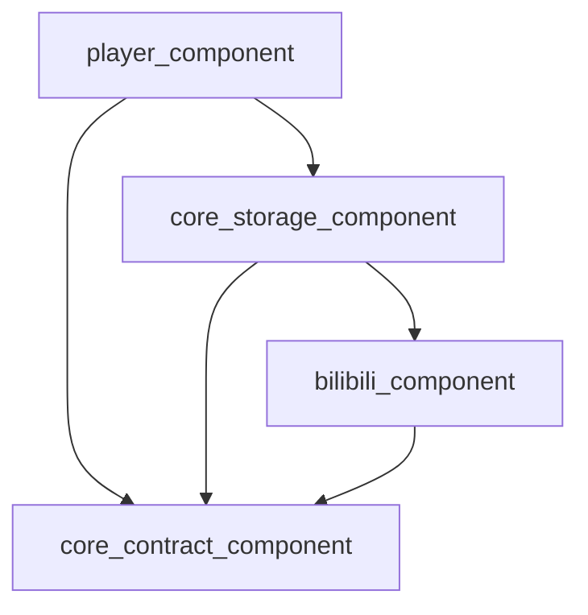

# 播放器-存储 播放期扩展（Playback Addon）解耦设计与任务拆分

**文档状态**：已落地（Implemented）  
**最后更新**：2026-01-09  
**关联现状分析**：`TODOs/player_kernel_bilibili_coupling_analysis.md`  
**落地状态**：T-01 ~ T-12 已全部完成（已验证 `./gradlew assembleDebug`，结果为 `BUILD SUCCESSFUL`）  

---

## 0. 已确认决策（逐项确认结果）

以下决策已逐项确认，本文后续方案与任务拆分均以此为准：

- 文档目录统一使用 `TODOs/`（不新增 `todos/`）。
- “播放器内核模块”范围按 **播放器播放栈整体**（包含 `PlayerActivity`/Controller/UI 编排）。
- Playback Addon/事件等 Contract 放在 `core_contract_component`。
- Addon 挂载点选择 **挂在 Source 上**，并采用 **Contract 侧 Provider 接口**形态（而非全局 Store / payload 主方案）。
- 失败恢复上下文采用 **通用请求 + addon 内部解释**（播放器不持有 B 站专属 FailureContext）。
- B 站画质/编码设置采用 **通用“播放源扩展设置页面”数据驱动**（不走“bilibili 专属 View”注入）。
- `PreferenceUpdate` 采用 **通用 schema + 通用更新动作**（不把 B 站字段固化进通用层）。
- Header/Referer 采用 **扩展 `Storage.getNetworkHeaders(file)`**，并将 Referer 逻辑迁回 `BilibiliStorage`（`StorageVideoSource` 不解析 `BilibiliKeys`）。
- B 站错误上报/直播会话统计迁入 **Bilibili addon**（播放器仅派发通用事件与诊断信息）。

### 0.1 落地结果（代码索引）

- Contract：`core_contract_component/src/main/java/com/xyoye/common_component/playback/addon/*`
- Source 挂载：`core_storage_component/src/main/java/com/xyoye/common_component/source/base/BaseVideoSource.kt`、`core_storage_component/src/main/java/com/xyoye/common_component/source/media/StorageVideoSource.kt`
- 事件派发：`player_component/src/main/java/com/xyoye/player/controller/base/BaseVideoController.kt`、`player_component/src/main/java/com/xyoye/player_component/ui/activities/player/PlayerActivity.kt`
- Bilibili addon：`bilibili_component/src/main/java/com/xyoye/common_component/bilibili/playback/BilibiliPlaybackAddon.kt`
- Header/Referer：`core_contract_component/src/main/java/com/xyoye/common_component/storage/Storage.kt`、`core_storage_component/src/main/java/com/xyoye/common_component/storage/impl/BilibiliStorage.kt`
- 设置页面（schema 渲染）：`player_component/src/main/java/com/xyoye/player/controller/setting/SettingPlaybackAddonView.kt`

---

## 1. 问题陈述

当前 Bilibili 播放链路的“播放期能力”（心跳上报、画质/编码切换、URL 恢复、错误上报补充信息等）被分散实现于：

- `core_storage_component`（`BilibiliStorage.createPlayUrl` 负责创建会话并写入全局 Store）
- `player_component`（`BaseVideoController` 直接调用 B 站心跳；`PlayerActivity` 直接驱动会话恢复/偏好切换）
- `data_component`（设置枚举中包含 `BILIBILI_PLAYBACK`）

这造成播放器模块对某个具体存储适配层“反向依赖”，违背“播放器通用、存储适配上游”的边界。

---

## 2. 目标与非目标

### 2.1 目标（Goals）

1. **建立跨存储统一的“播放期扩展”契约（Contract）**：播放器只依赖 Contract，不依赖具体存储模块（例如 bilibili）。
2. **事件驱动**：播放器把播放状态/进度/错误作为事件输出，存储扩展按需消费（如心跳）。
3. **能力可选**：只有需要的存储实现扩展；其它存储零成本接入。
4. **生命周期可控**：扩展与播放源/播放会话生命周期一致，避免全局 Store 的隐式状态。
5. **保留现有功能**：B 站心跳、偏好切换、失败恢复、错误上报依旧可用，且不降低稳定性。

### 2.2 非目标（Non-goals）

- 不在本设计中改写 B 站取流策略（选流/CDN/回退等属于取流层的演进，可单独设计）。
- 不强制统一所有存储的设置 UI 风格（但需要提供可扩展注入机制，避免枚举污染）。

---

## 3. 设计原则（软件工程规范）

1. **依赖倒置（DIP）**：高层（播放器）依赖抽象（Contract），低层（存储适配）实现抽象。
2. **开闭原则（OCP）**：新增存储专属能力时，不改动播放器基类，只新增一个扩展实现。
3. **单一职责（SRP）**：播放器不处理“上游协议/心跳/续签/参数”，存储适配不处理“播放器 UI/内核细节”。
4. **显式协议**：跨模块通信禁止使用“约定 key + 全局 store”作为主集成方式；必须通过接口与数据结构表达。
5. **渐进式迁移**：提供分阶段落地路径，确保每阶段可编译、可验证、可回滚。

---

## 4. 总体方案概述

引入一套“播放期扩展（Playback Addon）”机制：

- **播放器**：在统一位置产生播放事件（进度、状态、错误、结束、切源等），并将事件派发给当前播放源的 addon。
- **存储适配层**：为需要的存储提供 addon 实现（例如 `BilibiliPlaybackAddon`），内部封装会话、心跳、恢复与偏好切换等逻辑。
- **契约所在模块**：建议放在 `core_contract_component`（该模块已经承载 `Storage`、`StorageFile` 等跨模块 contract）。



**核心效果**：`player_component` 不再直接依赖 `bilibili_component`，只依赖 `core_contract_component` 与 `core_storage_component` 的通用能力。

---

## 5. 契约设计（Contract）

> 以下为“建议形态”，最终代码以可落地与与现有架构一致为准。

### 5.1 播放身份与事件

建议新增以下数据结构（放入 `core_contract_component`）：

```kotlin
data class PlaybackIdentity(
    val storageId: Int,
    val uniqueKey: String,
    val mediaType: MediaType,
    val storagePath: String?,
    val videoTitle: String,
    val videoUrl: String,
)

sealed class PlaybackEvent {
    /**
     * 播放源切换/初始化完成后派发。
     * 用于：live 会话统计重置、addon 状态机初始化等。
     */
    data class SourceChanged(
        val identity: PlaybackIdentity,
        val httpHeader: Map<String, String>?,
    ) : PlaybackEvent()

    data class PlayStateChanged(
        val identity: PlaybackIdentity,
        val playState: PlayState,
        val positionMs: Long,
    ) : PlaybackEvent()

    data class Progress(
        val identity: PlaybackIdentity,
        val positionMs: Long,
        val durationMs: Long,
        val isPlaying: Boolean,
    ) : PlaybackEvent()

    data class PlaybackError(
        val identity: PlaybackIdentity,
        val throwable: Throwable?,
        val scene: String,
        /**
         * 播放器侧可观测诊断信息（来源可能包含 Media3/播放器内核）。
         * 仅传递事实，不在通用层固化“某个存储专属字段”。
         */
        val diagnostics: Map<String, String> = emptyMap(),
    ) : PlaybackEvent()
}
```

说明：

- `PlaybackIdentity` 由播放器从 `VideoSource` 侧读取，不允许 addon 反向依赖播放器内部对象。
- `extra` 用于承载播放器内核可获取但不适合“强类型化”的诊断信息（例如 media3 最后一次 HTTP open 的简要快照）。

### 5.2 Addon 能力接口

```kotlin
interface PlaybackAddon {
    /**
     * Addon 唯一标识，用于日志与调试。
     * 建议格式："{mediaType}/{feature}"，例如 "bilibili/heartbeat"。
     */
    val addonId: String

    /**
     * 播放器派发的统一事件入口。
     * Addon 内部自行过滤关心的事件类型。
     */
    fun onEvent(event: PlaybackEvent)
}
```

#### 5.2.1 Addon 获取方式（Provider）

为避免播放器对 `BaseVideoSource` 强类型依赖，建议在 `core_contract_component` 新增 Provider 接口：

```kotlin
interface PlaybackAddonProvider {
    fun getPlaybackAddon(): PlaybackAddon?
}
```

实现建议：`core_storage_component` 的 `BaseVideoSource` 默认实现 `PlaybackAddonProvider` 并返回 `null`；需要扩展能力的 Source（例如 Bilibili StorageVideoSource）返回对应 addon 实例。

#### 5.2.2 可选能力：失败恢复 / 设置更新（返回新 URL）

对于“需要返回新 URL”的能力（偏好切换/失败恢复），采用“可选扩展接口”表达，避免所有 addon 必须实现：

```kotlin
interface PlaybackUrlRecoverableAddon : PlaybackAddon {
    /**
     * 返回值语义：
     * - Result.success(playUrl)：表示需要播放器重建 Source 并以该 URL 重新起播（续播到 positionMs）。
     * - Result.success(null)：表示无法恢复（由播放器走通用错误处理）。
     * - Result.failure(e)：表示恢复过程中发生异常（用于上报/日志）。
     */
    suspend fun recover(request: PlaybackRecoveryRequest): Result<String?>
}

interface PlaybackPreferenceSwitchableAddon : PlaybackAddon {
    /**
     * 返回值语义：
     * - Result.success(playUrl)：表示需要播放器重建 Source 并以该 URL 重新起播（续播到 positionMs）。
     * - Result.success(null)：表示设置已保存，但本次不重启播放（例如非 Media3 内核：提示“重新播放后生效”）。
     * - Result.failure(e)：表示切换失败（用于上报/日志）。
     */
    suspend fun applySettingUpdate(
        update: PlaybackSettingUpdate,
        positionMs: Long,
    ): Result<String?>
}
```

#### 5.2.3 设置数据（schema）获取

为匹配“通用播放源扩展设置页面”，建议在 Contract 中定义 schema：

```kotlin
data class PlaybackSettingSpec(
    val identity: PlaybackIdentity,
    val sections: List<Section>,
) {
    data class Section(
        val sectionId: String,
        val title: String,
        val items: List<Item>,
    )

    sealed class Item {
        data class SingleChoice(
            val settingId: String,
            val title: String,
            val options: List<Option>,
            val selectedOptionId: String?,
        ) : Item()
    }

    data class Option(
        val optionId: String,
        val label: String,
        val description: String? = null,
    )
}

data class PlaybackSettingUpdate(
    val settingId: String,
    val optionId: String,
)

data class PlaybackRecoveryRequest(
    val identity: PlaybackIdentity,
    val positionMs: Long,
    val playbackError: Throwable?,
    val diagnostics: Map<String, String> = emptyMap(),
)
```

并新增可选接口：

```kotlin
interface PlaybackSettingsAddon : PlaybackAddon {
    suspend fun getSettingSpec(): Result<PlaybackSettingSpec?>
}
```

### 5.3 Addon 生命周期与 Attach 点

为避免全局 Store，建议 addon 与播放源绑定，至少满足：

- 切源时 addon 一并替换
- 退出播放/销毁时 addon 生命周期结束（可选释放接口）

可选方案对比：

| 方案 | Attach 点 | 优点 | 缺点 | 建议 |
|---|---|---|---|---|
| A（最终采用） | `source as? PlaybackAddonProvider` 获取 addon | 播放器事件派发自然；生命周期清晰；可扩展到非 `BaseVideoSource` | 需要在 Source 层实现 Provider | **已选定** |
| B | `StorageFile` payload 携带 addon | 不改 source 接口；利用已有 `payloadAs()` | payload 属于“文件信息”，与播放期会话不完全等价 | 仅作为过渡备选 |
| C | 全局 Store（key=storageId+uniqueKey） | 改造成本低 | 隐式依赖仍在，长期问题不解 | 不作为最终形态 |

---

## 6. 模块职责重划分（目标架构）

### 6.1 player_component（目标）

- 只做“播放 + 事件采集/派发 + 通用 UI 框架”：
  - `BaseVideoController`：不再直接调用 `BilibiliPlaybackHeartbeat`；改为派发 `PlaybackEvent` 给当前 addon。
  - `PlayerActivity`：不再直接操作 `BilibiliPlaybackSessionStore/session`；改为通过 addon 能力接口完成“偏好切换/恢复/上报”。
- 移除 `implementation(project(":bilibili_component"))` 依赖。

### 6.2 core_storage_component（目标）

- `BilibiliStorage` 仍负责：
  - 上游取流（通过 `BilibiliRepository`）
  - MPD 生成/直播直链
  - 为 Bilibili 来源创建并附着 addon（或创建会话并交给 addon 管理）
- `StorageVideoSourceFactory`：在创建 `StorageVideoSource` 时为其附着 addon（如果 storage 支持）。

### 6.3 bilibili_component（目标）

- 提供 B 站专属 addon 实现（封装会话、心跳、恢复、偏好切换、错误上报等）。
- 上游对接逻辑仍留在 `BilibiliRepository`，addon 调用 repository 完成“播放期动作”。

### 6.4 core_contract_component / data_component（目标）

为减少枚举污染与跨层依赖，建议：

- `core_contract_component`：承载播放期扩展 Contract 与必要的数据结构（事件、identity、可选能力接口）。
- `data_component`：避免新增类似 `BILIBILI_PLAYBACK` 的枚举项。对于已有项，迁移路径需在任务拆分中规划。

---

## 7. 关键迁移点（从现状到目标）

### 7.1 替换 BaseVideoController 的心跳硬编码

现状：

- `BaseVideoController.kt:248` / `BaseVideoController.kt:353` 直接调用 `BilibiliPlaybackHeartbeat`。

目标：

- `BaseVideoController` 只生成 `PlaybackEvent` 并派发给当前 source 的 addon（若存在），B 站心跳变为 `BilibiliPlaybackAddon` 的内部实现细节。

### 7.2 替换 PlayerActivity 的“偏好切换/失败恢复”硬编码

现状：

- `PlayerActivity.kt:474` / `PlayerActivity.kt:984` 直接通过 `BilibiliPlaybackSessionStore` 驱动 `applyPreferenceUpdate/recover` 并重建 source。

目标：

- `PlayerActivity` 只做“通用的换源/续播/Loading UI 编排”，具体 URL 获取由 addon 返回：
  - 成功返回 `newPlayUrl` → 复用现有 `rebuildStorageVideoSource(...)` 与 `applyPlaySource(...)`
  - 返回空/失败 → 使用通用错误处理

### 7.3 Header/Referer 逻辑回归 Storage

现状：

- `StorageVideoSource.kt:70` 解析 `BilibiliKeys` 并注入 Referer。

目标：

- 在 `Storage` contract 增加更细粒度的 header API（建议）：`fun getNetworkHeaders(file: StorageFile): Map<String, String>?`
- 默认实现回落到旧 `getNetworkHeaders()`，BilibiliStorage 覆盖实现并完成 Referer 注入。
- `StorageVideoSource.getHttpHeader()` 只调用 `storage.getNetworkHeaders(file)`，不再解析任何上游专属 key。

### 7.4 设置系统的“存储专属设置”注入机制

现状：

- `SettingViewType.BILIBILI_PLAYBACK` + `SettingBilibiliPlaybackView` 存在于播放器设置体系中。

目标（已确认方案，仍分两阶段落地）：

1) 过渡：新增通用“播放源扩展设置页面”（数据驱动），B 站设置先迁移到该页面；旧 `SettingViewType.BILIBILI_PLAYBACK` 保留但不再演进。  
2) 完整：移除 `SettingViewType.BILIBILI_PLAYBACK` 及 `SettingBilibiliPlaybackView`，并将“扩展设置入口”统一为 addon 驱动（播放器仅渲染 schema）。

---

## 8. 任务拆分（WBS）

> 任务以“可独立评审、可独立验证、可回滚”为原则拆分。

### 8.1 里程碑划分

- **M1：建立 Contract + 事件派发（不改业务行为）**
- **M2：Bilibili addon 接入（替换心跳/恢复/切换）**
- **M3：移除播放器对 bilibili_component 依赖**
- **M4：Header/Referer 回归 Storage**
- **M5：设置系统扩展化（去枚举污染）**

### 8.2 任务列表

| ID | 任务 | 影响模块 | 产出/交付物 | 验收标准 |
|---|---|---|---|---|
| T-01 | 定义 `PlaybackIdentity/PlaybackEvent/PlaybackAddon` 等 Contract | `core_contract_component` | 新增 Kotlin contract 文件 | `player_component` 不需要 import bilibili 即可编译引用 contract |
| T-02 | 定义 `PlaybackAddonProvider/PlaybackSettingSpec/...` Contract | `core_contract_component` | 新增 Provider + schema + request 类型 | Contract 不包含 bilibili 专属类型 |
| T-03 | Source 层实现 Provider 并完成 addon attach | `core_storage_component` / `bilibili_component` | `BaseVideoSource` 默认返回 null；B 站 Source 返回 bilibili addon | 非 B 站来源 addon 为 null，行为不变 |
| T-04 | `BaseVideoController` 改为派发 `PlaybackEvent` | `player_component` | 删除 `BilibiliPlaybackHeartbeat` 直接调用 | 播放 B 站时心跳仍能上报（由 addon 实现） |
| T-05 | `BilibiliPlaybackAddon`：封装心跳/错误上报/live 会话统计 | `bilibili_component` | 新增 addon 实现 | 心跳/上报触发条件与现状一致 |
| T-06 | `BilibiliPlaybackAddon`：实现设置 schema 与更新动作 | `bilibili_component` | 提供 `PlaybackSettingsAddon` + `PlaybackPreferenceSwitchableAddon` 能力 | Media3 下可切换并续播；非 Media3 返回 null（提示重新播放生效） |
| T-07 | `BilibiliPlaybackAddon`：实现失败恢复能力 | `bilibili_component` | 提供 `PlaybackUrlRecoverableAddon` 能力 | 失败时自动恢复逻辑可触发，最多重试次数一致 |
| T-08 | 播放器侧接入 addon（替换 session store + bilibili reporter） | `player_component` | `PlayerActivity` 使用 addon 能力接口 | B 站切换/恢复/上报逻辑通过 addon 完成；其它来源不受影响 |
| T-09 | 移除 `player_component -> bilibili_component` 依赖 | `player_component` | 修改 `build.gradle.kts` | 全量编译通过；`player_component` 无 bilibili import |
| T-10 | Header/Referer API 细化并迁移 B 站逻辑回 Storage | `core_contract_component` / `core_storage_component` / `bilibili_component` | 新增 `getNetworkHeaders(file)` 并迁移逻辑 | `StorageVideoSource` 不再解析 `BilibiliKeys`；B 站请求仍带 referer |
| T-11 | 新增通用“播放源扩展设置页面”（schema 渲染） | `player_component` | 新增通用设置 View + 与 addon 交互 | B 站设置在该页面可用，且 `player_component` 不依赖 bilibili |
| T-12 | 清理旧 B 站专属设置入口（去枚举污染） | `player_component` / `data_component` | 移除 `SettingViewType.BILIBILI_PLAYBACK` 与 `SettingBilibiliPlaybackView` | Setting 枚举不再承载存储专属项；扩展设置完全由 addon 驱动 |

---

## 9. 验证与测试计划

### 9.1 编译与依赖验证

- 目标：`player_component` 不再依赖 `:bilibili_component`，且全工程可编译。
- 验证点：
  - `player_component/build.gradle.kts` 不包含 bilibili 依赖；
  - `player_component` 源码中无 `com.xyoye.common_component.bilibili.*` import。

### 9.2 行为回归验证（关键场景）

1. 播放 B 站历史条目（UGC/PGC）可正常起播  
2. 播放 B 站直播可正常起播（且不会误触发“非 live 的恢复/切换”）  
3. B 站画质/编码切换：  
   - Media3：切换后能拿到新 URL 并续播到原进度  
   - 非 Media3：保持“保存设置，下次生效”的策略（与现状一致）  
4. B 站播放失败自动恢复：可触发、次数限制一致、恢复后提示一致  
5. 心跳上报：播放中定时发送，暂停/结束时发送/清理符合现状  

### 9.3 可观测性

- addon 需要统一日志 tag（如 `PlaybackAddon/{addonId}`），便于定位问题与回归对比。

---

## 10. 风险与缓解

| 风险 | 描述 | 缓解措施 |
|---|---|---|
| 改动面大导致回归 | 播放器与存储交界处重构容易引入遗漏 | 按里程碑逐步合并；每阶段具备可运行的回归验证清单 |
| 生命周期管理不当 | addon 与播放源/Activity 生命周期错位，导致泄漏或状态错乱 | 设计中明确 attach 点与释放时机；提供统一 `release`（如需要） |
| 设置系统扩展化复杂 | 去枚举污染涉及 UI 框架改造 | 拆分为过渡与最终两阶段；先完成“类型解耦”，再做“视图注入” |

---

## 11. 备选方案（不推荐但可对比）

1. **继续保留全局 session store，只把调用点包一层**：短期成本低，但隐式耦合仍在，长期无法避免雪球效应。
2. **把 Bilibili 相关逻辑全部留在 PlayerActivity 但改为反射/可选依赖**：会引入运行时不确定性与维护成本，不符合工程化规范。

---

## 12. 附录：现状关键引用（便于定位）

- 依赖：`player_component/build.gradle.kts:154`、`core_storage_component/build.gradle.kts:17`
- 会话创建：`core_storage_component/.../BilibiliStorage.kt:362`
- 心跳硬编码：`player_component/.../BaseVideoController.kt:248`、`player_component/.../BaseVideoController.kt:353`
- 切换/恢复硬编码：`player_component/.../PlayerActivity.kt:474`、`player_component/.../PlayerActivity.kt:984`
- Referer 注入：`core_storage_component/.../StorageVideoSource.kt:70`
