# 模块直接依赖快照（Gradle `project(...)`）

本文件由脚本自动生成：`python3 scripts/module_deps_snapshot.py --write`

- 数据来源：`settings.gradle.kts` + 各模块 `build.gradle.kts`
- 口径：仅统计 `dependencies { ... project(":...") ... }` 中的 **模块级直接依赖**（不包含外部库依赖）
- 注意：静态解析无法覆盖 Gradle 条件分支/插件注入等场景；如出现争议以实际编译为准

## 汇总

- 模块数：21
- 依赖条目数：89（生产 88 / 测试 1）

## 依赖列表（按模块）

### :app

**生产依赖**
- `implementation`：:anime_component, :core_contract_component, :core_database_component, :core_log_component, :core_network_component, :core_system_component, :core_ui_component, :data_component, :local_component, :player_component, :storage_component, :user_component

**测试依赖**
- （无）

### :local_component

**生产依赖**
- `implementation`：:bilibili_component, :core_contract_component, :core_database_component, :core_log_component, :core_network_component, :core_storage_component, :core_system_component, :core_ui_component, :data_component

**测试依赖**
- （无）

### :anime_component

**生产依赖**
- `implementation`：:core_contract_component, :core_database_component, :core_log_component, :core_network_component, :core_storage_component, :core_system_component, :core_ui_component, :data_component

**测试依赖**
- （无）

### :user_component

**生产依赖**
- `implementation`：:bilibili_component, :core_contract_component, :core_database_component, :core_log_component, :core_network_component, :core_storage_component, :core_system_component, :core_ui_component, :data_component

**测试依赖**
- （无）

### :storage_component

**生产依赖**
- `implementation`：:bilibili_component, :core_contract_component, :core_database_component, :core_log_component, :core_network_component, :core_storage_component, :core_system_component, :core_ui_component, :data_component

**测试依赖**
- （无）

### :player_component

**生产依赖**
- `implementation`：:core_contract_component, :core_database_component, :core_log_component, :core_network_component, :core_storage_component, :core_system_component, :core_ui_component, :data_component, :repository:danmaku, :repository:panel_switch, :repository:video_cache

**测试依赖**
- （无）

### :data_component

**生产依赖**
- （无）

**测试依赖**
- （无）

### :core_contract_component

**生产依赖**
- `api`：:data_component

**测试依赖**
- （无）

### :core_log_component

**生产依赖**
- `implementation`：:data_component

**测试依赖**
- （无）

### :core_system_component

**生产依赖**
- `implementation`：:core_contract_component, :core_log_component, :data_component

**测试依赖**
- （无）

### :core_network_component

**生产依赖**
- `implementation`：:core_log_component, :core_system_component, :data_component

**测试依赖**
- `testImplementation`：:core_contract_component

### :core_database_component

**生产依赖**
- `implementation`：:core_system_component, :data_component

**测试依赖**
- （无）

### :core_storage_component

**生产依赖**
- `implementation`：:bilibili_component, :core_contract_component, :core_database_component, :core_log_component, :core_network_component, :core_system_component, :data_component, :repository:seven_zip, :repository:thunder

**测试依赖**
- （无）

### :core_ui_component

**生产依赖**
- `api`：:repository:immersion_bar
- `implementation`：:core_contract_component, :core_log_component, :core_system_component, :data_component

**测试依赖**
- （无）

### :bilibili_component

**生产依赖**
- `implementation`：:core_contract_component, :core_database_component, :core_log_component, :core_network_component, :core_system_component, :data_component

**测试依赖**
- （无）

### :repository:danmaku

**生产依赖**
- （无）

**测试依赖**
- （无）

### :repository:immersion_bar

**生产依赖**
- （无）

**测试依赖**
- （无）

### :repository:panel_switch

**生产依赖**
- （无）

**测试依赖**
- （无）

### :repository:seven_zip

**生产依赖**
- （无）

**测试依赖**
- （无）

### :repository:thunder

**生产依赖**
- （无）

**测试依赖**
- （无）

### :repository:video_cache

**生产依赖**
- （无）

**测试依赖**
- （无）

## Mermaid（生产依赖）

```mermaid
graph TD
  anime_component[":anime_component"]
  app[":app"]
  bilibili_component[":bilibili_component"]
  core_contract_component[":core_contract_component"]
  core_database_component[":core_database_component"]
  core_log_component[":core_log_component"]
  core_network_component[":core_network_component"]
  core_storage_component[":core_storage_component"]
  core_system_component[":core_system_component"]
  core_ui_component[":core_ui_component"]
  data_component[":data_component"]
  local_component[":local_component"]
  player_component[":player_component"]
  repository_danmaku[":repository:danmaku"]
  repository_immersion_bar[":repository:immersion_bar"]
  repository_panel_switch[":repository:panel_switch"]
  repository_seven_zip[":repository:seven_zip"]
  repository_thunder[":repository:thunder"]
  repository_video_cache[":repository:video_cache"]
  storage_component[":storage_component"]
  user_component[":user_component"]

  anime_component --> core_contract_component
  anime_component --> core_database_component
  anime_component --> core_log_component
  anime_component --> core_network_component
  anime_component --> core_storage_component
  anime_component --> core_system_component
  anime_component --> core_ui_component
  anime_component --> data_component
  app --> anime_component
  app --> core_contract_component
  app --> core_database_component
  app --> core_log_component
  app --> core_network_component
  app --> core_system_component
  app --> core_ui_component
  app --> data_component
  app --> local_component
  app --> player_component
  app --> storage_component
  app --> user_component
  bilibili_component --> core_contract_component
  bilibili_component --> core_database_component
  bilibili_component --> core_log_component
  bilibili_component --> core_network_component
  bilibili_component --> core_system_component
  bilibili_component --> data_component
  core_contract_component --> data_component
  core_database_component --> core_system_component
  core_database_component --> data_component
  core_log_component --> data_component
  core_network_component --> core_log_component
  core_network_component --> core_system_component
  core_network_component --> data_component
  core_storage_component --> bilibili_component
  core_storage_component --> core_contract_component
  core_storage_component --> core_database_component
  core_storage_component --> core_log_component
  core_storage_component --> core_network_component
  core_storage_component --> core_system_component
  core_storage_component --> data_component
  core_storage_component --> repository_seven_zip
  core_storage_component --> repository_thunder
  core_system_component --> core_contract_component
  core_system_component --> core_log_component
  core_system_component --> data_component
  core_ui_component --> core_contract_component
  core_ui_component --> core_log_component
  core_ui_component --> core_system_component
  core_ui_component --> data_component
  core_ui_component --> repository_immersion_bar
  local_component --> bilibili_component
  local_component --> core_contract_component
  local_component --> core_database_component
  local_component --> core_log_component
  local_component --> core_network_component
  local_component --> core_storage_component
  local_component --> core_system_component
  local_component --> core_ui_component
  local_component --> data_component
  player_component --> core_contract_component
  player_component --> core_database_component
  player_component --> core_log_component
  player_component --> core_network_component
  player_component --> core_storage_component
  player_component --> core_system_component
  player_component --> core_ui_component
  player_component --> data_component
  player_component --> repository_danmaku
  player_component --> repository_panel_switch
  player_component --> repository_video_cache
  storage_component --> bilibili_component
  storage_component --> core_contract_component
  storage_component --> core_database_component
  storage_component --> core_log_component
  storage_component --> core_network_component
  storage_component --> core_storage_component
  storage_component --> core_system_component
  storage_component --> core_ui_component
  storage_component --> data_component
  user_component --> bilibili_component
  user_component --> core_contract_component
  user_component --> core_database_component
  user_component --> core_log_component
  user_component --> core_network_component
  user_component --> core_storage_component
  user_component --> core_system_component
  user_component --> core_ui_component
  user_component --> data_component
```

