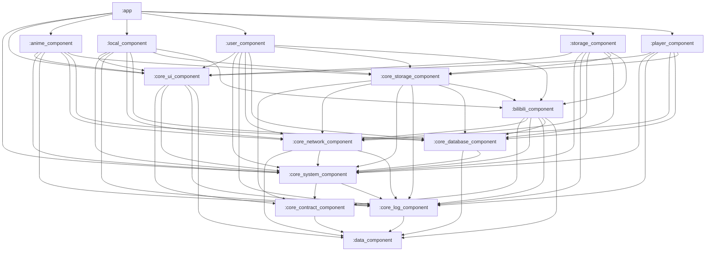

# 模块依赖治理规范（v2）（面向 DanDanPlayForAndroid）

> 说明：本文件曾位于 `TODOs/`，现作为长期维护的依赖治理文档存放于 `document/architecture/`。

本文基于当前仓库 **实际 Gradle 依赖**（`settings.gradle.kts` + 各模块 `build.gradle.kts` 的 `project(...)`）与仓库内“理想模块依赖关系图（建议目标）”，整理出：

- 当前依赖关系的 **真实形态**（哪些差异是“文档过期/设计演进”，哪些是“可治理的问题”）
- 一套更贴近现状、可逐步落地的 **目标依赖模型（v2）**
- **依赖治理规则**（允许矩阵/禁止规则/`api` 暴露策略/白名单）
- **自动化校验与维护流程**（Gradle 校验任务 + CI）
- 关键 **决策记录（DR）**（用于解释“为何允许/禁止”）

> 说明：本文关注“模块依赖治理/分层一致性”，不讨论业务功能本身的对错；优先追求架构逻辑一致与可持续演进，而不是最小侵入式补丁。

---

## 快速入口（治理基线）

- 当前直接依赖快照（自动生成）：`document/architecture/module_dependencies_snapshot.md`
- 快照生成脚本：`python3 scripts/module_deps_snapshot.py --write`
- 自动化校验：`./gradlew verifyModuleDependencies`（CI：`.github/workflows/module-dependency-governance.yml`）

---

## 0. 范围与约定

### 0.1 覆盖范围（以 `settings.gradle.kts` 为准）

本次治理范围仅覆盖当前主工程纳入构建的模块（共 21 个）：

- 入口壳：`:app`
- 业务功能：`:anime_component` `:local_component` `:user_component` `:storage_component` `:player_component`
- 基础层：`:data_component`
- 核心层：`:core_contract_component` `:core_system_component` `:core_log_component` `:core_network_component` `:core_database_component` `:core_storage_component` `:core_ui_component` `:bilibili_component`
- 内置仓库依赖：`:repository:*`（`danmaku/immersion_bar/panel_switch/seven_zip/thunder/video_cache`）

### 0.2 不在范围（但需要“标注与隔离”）

仓库中还存在但未纳入当前主工程构建的目录，例如：`core_notification_component/`、`core_service_component/`、`remote_component/`、`Han1meViewer/` 等。本次文档只做备注，不把它们纳入依赖治理目标；后续若重新纳入构建，需要按本文规则补齐依赖矩阵。

### 0.3 “依赖”的口径

- 本文的“依赖关系”默认指 **Gradle module 级依赖**（`implementation/api/testImplementation(project(...))`）。
- “理想依赖关系图”是 **概念分层建议**，与 Gradle 的 `api/implementation` 暴露策略存在偏差时，可能出现“表面缺失/表面多余但编译仍成立”的情况。
- 因此本文会把问题拆成三类：  
  1) **文档过期/架构演进**（需要更新目标图）  
  2) **依赖声明策略问题**（`api` 泄漏导致边界不清）  
  3) **真实分层违例/职责漂移**（需要代码或模块边界调整）

---

## 1. 现状快照：各模块的直接依赖（来自 `build.gradle.kts`）

> 以下仅列出对“分层与治理”最关键的 module 依赖；完整直接依赖快照见：`document/architecture/module_dependencies_snapshot.md`。

### 1.1 入口壳 `:app`

直接依赖（`app/build.gradle.kts`）：

- `implementation(:core_system_component)`
- `implementation(:core_log_component)`
- `implementation(:core_ui_component)`
- `implementation(:core_contract_component)`
- `implementation(:data_component)`
- `implementation(:player_component/:anime_component/:user_component/:local_component/:storage_component)`

典型使用点（证明 `:app` 已收敛为“壳层触发入口”，不再直接使用 network/db 实现）：

- `app/src/main/java/com/xyoye/dandanplay/ui/shell/ShellViewModel.kt`  
  - 通过 `UserSessionService/CloudDanmuBlockService` 触发登录态恢复、云端屏蔽词同步等启动任务；具体实现已下沉到所属域模块。
- `core_database_component/src/main/java/com/xyoye/common_component/database/migration/ManualMigrationInitializer.kt`  
  - 启动阶段触发 `ManualMigration.migrate()`，`app` 不再负责迁移编排。

### 1.2 业务功能模块（feature）

直接依赖（`*/build.gradle.kts`）呈现明显“扁平化”：

- `:anime_component`：依赖 `core_ui/system/log/network/database/storage`
- `:local_component`：依赖 `core_ui/system/log/network/database/storage` + `bilibili`
- `:user_component`：依赖 `core_ui/system/log/network/database/storage` + `bilibili`
- `:storage_component`：依赖 `core_ui/system/log/network/database/storage` + `bilibili`
- `:player_component`：依赖 `core_ui/system/log/network/database/storage` + `repository:*`

这些依赖多数是“被真实使用”的，例如：

- `anime_component` 使用 `DatabaseManager`、`AnimeRepository`、`ErrorReportHelper`、`AppConfig/UserConfig` 等，因此对 `db/network/log/system` 的依赖在当前代码组织下是合理的。
- `local_component/storage_component/user_component` 存在大量 `com.xyoye.common_component.bilibili.*` 的引用，因此对 `:bilibili_component` 的直接依赖不是“冗余”。

### 1.3 核心层（core_*）与 bilibili

- `:core_contract_component`
  - `api(:data_component)`（对外暴露契约与数据类型）
- `:core_log_component`
  - `implementation(:data_component)`（避免向上层泄漏 data）
- `:core_system_component`
  - `implementation(:core_contract_component/:core_log_component/:data_component)`
  - 关键原因：`core_system_component/src/main/java/com/xyoye/common_component/base/app/BaseApplication.kt` 中直接调用 `BuglyReporter`/`LogFacade`，且需要“尽早初始化 Bugly 捕获 Application onCreate 之前崩溃”。
- `:core_network_component`
  - `implementation(:data_component/:core_log_component/:core_system_component)`
  - `testImplementation(:core_contract_component)`（仅测试用）
- `:core_database_component`
  - `implementation(:data_component/:core_system_component)`
- `:bilibili_component`
  - `implementation(:core_contract_component/:core_network_component/:core_log_component/:core_system_component/:core_database_component/:data_component)`
- `:core_storage_component`
  - `implementation(:core_contract_component/:data_component/:core_network_component/:core_system_component/:core_log_component/:core_database_component/:bilibili_component)`
  - `implementation(:repository:seven_zip/:repository:thunder)`
- `:core_ui_component`
  - `implementation(:core_contract_component/:core_system_component/:core_log_component/:data_component)`
  - `api(:repository:immersion_bar)`

---

## 2. 与“理想依赖关系图”的差异：哪些是问题，哪些是目标应更新

### 2.1 文档过期/设计演进导致的差异（不建议硬改去“贴图”）

典型表现：

- 理想图中 `:local_component` 不依赖 `:core_network_component`，但当前 local 业务包含字幕/弹幕等联网能力，实际需要 network（例如 `local_component/.../SubtitleSearchHelper.kt` 使用 `ResourceRepository`）。
- 理想图中 `:storage_component` 不依赖 `:bilibili_component`，但当前 storage 模块内包含 B 站登录/媒体库配置 UI（`storage_component/ui/dialog/BilibiliLoginDialog.kt` 等），直接依赖 bilibili 是自然结果。
- 理想图中 `:app` 不依赖 network/db/log；当前已收敛 network/db：`:app` 不再直接依赖 `:core_network_component/:core_database_component`，跨域初始化通过契约 Service / Startup initializer 下沉到对应域模块（log/system 作为 runtime 组合根依赖仍保留）。

这类差异更像“架构目标没有同步演进”，应先明确：我们到底要回到理想图，还是把目标图升级到 v2。

### 2.2 依赖声明策略造成的“表面缺失/表面多余”

典型是 `api` 传递导致的边界模糊：

- 已收敛：将大多数 `api(project(...))` 改为 `implementation`，并在使用方补齐显式依赖，避免“通过实现层拿类型”的隐式耦合。
- 典型历史问题包括：`core_system_component/core_ui_component/core_storage_component` 曾通过 `api` 传递暴露类型边界；现状已按规则修复（见 DR-0003 与依赖快照）。

这类“隐式获得”本身不一定错误，但会导致：

- build.gradle 的依赖声明无法反映真实耦合
- 后续要收紧依赖边界时，很容易“牵一发动全身”

### 2.3 真实的分层违例/可治理问题（建议优先处理）

最典型且收益很高的一条：

- 现状：`core_ui_component` 不再直接依赖 `core_storage_component`
  - 但 `core_ui_component` 内部对“存储域”的引用目前可见的主要是 `StorageFile`（例如 `core_ui_component/.../ImageViewExt.kt` 的 `loadStorageFileCover(file: StorageFile)`），而 `StorageFile` 实际定义在 `core_contract_component`：`core_contract_component/src/main/java/com/xyoye/common_component/storage/file/StorageFile.kt`。
  - 这意味着：`core_ui_component -> core_storage_component` 很可能是“历史遗留 + 通过 storage 的 api 间接拿到 contract 类型”，而不是 UI 基建真实需要 storage 的实现层。

这条一旦治理到位，就能把“UI 基建层依赖 infra 实现层”的典型分层违例消掉，并为后续规则化校验打基础。

---

## 3. 关键问题清单（按优先级）

### P0：文档与实现不一致，导致团队认知分裂

当“理想图”与“Gradle 现实”偏差较大时：

- 新人/协作者会按理想图做设计，但落地时被迫引入更多依赖，最终形成“随便加依赖也没关系”的氛围。
- 依赖治理无法推进：没人知道应该治理到哪里，治理的成功标准是什么。

### P1：`api` 传递导致边界模糊，长期会反噬依赖治理

现状已经出现“依赖 A 只是为了拿到 A 暴露出来的 B 的类型”的情况（典型是 `core_ui_component` 依赖 `core_storage_component` 以间接获得 contract 类型）。这种模式会：

- 放大模块耦合：一个底层模块的 `api` 改动影响上层大面积编译
- 让“移除/替换实现”变得困难（因为实现模块被当成类型来源使用）

### P1：核心模块命名与职责边界不清（system/log 的层级含义需重新定义）

当前 `core_system_component` 直接依赖 `core_log_component`，且 `BaseApplication` 负责 Bugly 初始化与日志记录，这在工程上合理，但与“system/log 分层”的直觉含义冲突：

- 如果 `core_system_component` 被视为“纯系统基建”，它理应不依赖 log；
- 但如果它被视为“应用运行时/启动编排（runtime）”，依赖 log 则合理。

需要做一次 **命名/分层语义对齐**（不一定要立刻重构，但必须给出目标定义）。

### P2：`:app` 中存在跨域业务编排，分层“事实”与“概念”不一致

**现状**

- `:app` 仅保留启动触发入口，不再直接使用 network/db；具体实现下沉到所属域模块（通过契约 Service / Startup initializer 装配）。

壳层启动链路触发了：

- 用户 refresh_token 续期（用户域，`UserSessionService` -> `user_component`）
- 云端屏蔽词同步并写入数据库（弹幕/播放器域 + 数据域，`CloudDanmuBlockService` -> `player_component`）
- 数据迁移触发（数据域，`ManualMigrationInitializer` -> `core_database_component`）

这不是“错”，但如果目标是让 `:app` 成为组合根/壳层，则需要逐步把这些编排下沉到对应域（或通过契约服务化）。

---

## 4. 方案设计：建立“现状可落地”的目标依赖模型（v2）

### 4.1 目标原则（治理规则）

1) **单向依赖、无环**：任何调整都必须保持无环  
2) **契约优先**：跨模块交互优先通过 `:core_contract_component` 的接口/契约完成  
3) **UI 基建不依赖 infra 实现**：`core_ui_component` 不直接依赖 `core_storage_component/bilibili_component/core_network_component/core_database_component` 的“实现层”  
4) **`api` 收敛**：默认 `implementation`，只有当“模块对外公开 API”确实暴露了对方类型时才使用 `api`，并在 build.gradle 写清理由  
5) **feature 可依赖 infra，但要有边界**：允许 feature 直接依赖 network/db/bilibili 等 infra（现实需求），但要明确“哪些能力应该走 storage/contract 统一入口”，避免同一类能力到处散落

### 4.2 建议的“目标依赖图 v2（短期）”

短期目标：先消除明确违例（`ui -> storage`），再通过规则化与重构逐步收敛。

> 备注：上图中 feature 对 infra 的直接依赖仍然存在（这是“按现状可落地”的选择），治理重点是：**把不该依赖的依赖移除**，并逐步把“横向复用能力”收敛到 contract/storage 层。

### 4.3 v2 依赖规则（允许/禁止列表）

> 目的：把“目标依赖图 v2”落到可用于 code review 的规则，并通过自动化校验让规则可执行（见第 5 节）。

#### 4.3.1 分层与模块归类（v2）

| 分层 | 模块 | 备注 |
| --- | --- | --- |
| app（组合根/壳层） | `:app` | 允许保留少量跨域编排（已收敛，优先下沉到所属域） |
| feature（业务功能） | `:anime_component` `:local_component` `:user_component` `:storage_component` `:player_component` | feature 之间禁止互相依赖 |
| ui（UI 基建） | `:core_ui_component` | **不得依赖实现层**（storage/network/db/bilibili 等） |
| infra（基础设施实现） | `:core_storage_component` `:bilibili_component` `:core_network_component` `:core_database_component` | 可被 feature 直接依赖（按现状），但要控制边界 |
| runtime（系统/运行时编排） | `:core_system_component` `:core_log_component` | system/log 的语义见“决策记录” |
| contract（跨模块契约） | `:core_contract_component` | 跨模块类型/接口优先下沉到此层 |
| data（共享数据类型） | `:data_component` | 只承载纯数据/类型，不反向依赖其他模块 |
| repository（内置 AAR 封装） | `:repository:*` | 只提供封装，不反向依赖其他模块 |

#### 4.3.2 允许的直接依赖（v2）

以“直接 Gradle module 依赖”为准，允许如下方向（未列出即默认不推荐/需评审）：

- `:app` -> `feature` / `core_*`（组合根允许依赖所有上层业务与基础设施入口）
- `feature` -> `:core_ui_component` / `:core_system_component` / `:core_log_component` / `:core_network_component` / `:core_database_component` / `:core_storage_component` / `:bilibili_component` / `:core_contract_component` / `:data_component`（仅当确实需要；优先走 contract/storage 的统一入口）
- `:core_ui_component` -> `:core_contract_component` / `:core_system_component` / `:core_log_component` / `:data_component` / `:repository:immersion_bar`
- `:core_storage_component` -> `:core_contract_component` / `:core_network_component` / `:core_database_component` / `:core_system_component` / `:core_log_component` / `:bilibili_component` / `:data_component` / `:repository:seven_zip` / `:repository:thunder`
- `:bilibili_component` -> `:core_contract_component` / `:core_network_component` / `:core_database_component` / `:core_system_component` / `:core_log_component` / `:data_component`
- `:core_network_component` -> `:core_system_component` / `:core_log_component` / `:data_component`（测试可额外依赖 `:core_contract_component`）
- `:core_database_component` -> `:core_system_component` / `:data_component`
- `:core_system_component` -> `:core_contract_component`（以及 `:core_log_component`，取决于 system/log 路线）
- `:core_log_component` -> `:data_component`
- `:core_contract_component` -> `:data_component`
- `:data_component` / `:repository:*` -> （不依赖本工程其他模块）

#### 4.3.3 明确禁止（v2，硬规则）

- 禁止任何 feature 之间互相依赖（如 `:anime_component -> :player_component`）。
- 禁止 core/infra/contract/data/repository 反向依赖 `:app` 或任何 feature（避免依赖倒置引入环）。
- 禁止 `:core_ui_component` 依赖实现层（`core_storage_component/core_network_component/core_database_component/bilibili_component` 以及 `:repository:*` 中除 `:repository:immersion_bar` 外的模块）。
- 禁止为了“拿到 transitive 类型”而新增实现层依赖；应把类型下沉到 `:core_contract_component`（或 `:data_component`）。

#### 4.3.4 `api` 暴露策略（v2，code review 规则）

- 默认使用 `implementation`；仅当 **本模块对外公开 API** 必须暴露对方类型时才允许使用 `api(project(...))`，并在对应 `build.gradle.kts` 写清楚理由。
- 禁止对外通过 `api` 泄漏实现层（尤其是 `:core_storage_component` / `:bilibili_component` / `:core_network_component` / `:core_database_component` / `:repository:*`）；若短期无法调整，必须在“决策记录”登记为遗留并给出迁移计划。

### 4.4 中期演进方向：解决 system/log 的语义冲突（两条路线）

为了让“模块名=职责”更一致，建议在中期做一次明确选择：

**路线 A：接受 `system -> log`，更新架构文档**

- 把 `core_system_component` 定义为“应用运行时（runtime）/启动编排与系统能力整合”，它依赖 log 是合理的。
- 代价：与传统分层直觉略有冲突，但改动最小。

**路线 B：拆分 Application/启动编排为新模块（推荐更一致，但成本更高）**

- 新增 `:core_app_component`（或 `:app_runtime_component`）：
  - 存放 `BaseApplication`、启动初始化编排（Bugly/ARouter/Notifications/MMKV 等）
  - 依赖 `core_system_component` + `core_log_component`（以及必要的第三方）
- 让 `core_system_component` 回归“纯系统基建”：
  - 不再依赖 `core_log_component`
  - 只保留 config/工具/基础设施封装（尽量不含第三方初始化编排）
- 这条路线能最大化对齐“理想分层”，并让后续依赖治理更清晰。

---

## 5. 自动化校验与维护流程

### 5.1 校验口径（范围）

- 仅校验 Gradle module 的**直接依赖**：`dependencies { ... project(":...") ... }`
- 不校验外部库依赖；不展开 transitive 依赖图
- 依赖快照参考：`document/architecture/module_dependencies_snapshot.md`

### 5.2 本地校验

- 执行：`./gradlew verifyModuleDependencies`
- 失败时输出：按“模块 -> configuration -> 违例依赖”列出，并指向本文档作为规则依据

### 5.3 CI 校验（PR）

- workflow：`.github/workflows/module-dependency-governance.yml`
- 触发：`pull_request`

### 5.4 规则变更流程（新增模块/新增依赖）

当出现以下场景之一，需要同步更新规则与校验实现：

- 新增模块（`settings.gradle.kts` 新增 `include(...)`）
- 新增/调整 `project(":...")` 直接依赖
- 新增对 `:bilibili_component` 的直接依赖（需更新 DR-0002 白名单）
- 新增 `api(project(...))`（需更新 DR-0003 白名单，并在对应 `build.gradle.kts` 写清理由）

变更步骤：

1) 更新本文档的允许矩阵/白名单（含 DR）  
2) 同步更新 `buildSrc/src/main/java/governance/ModuleDependencyGovernance.kt` 的矩阵/白名单  
3) 运行 `./gradlew verifyModuleDependencies`，确认输出以 `BUILD SUCCESSFUL` 结束  
4) 如涉及依赖结构变化，同步更新依赖快照：`python3 scripts/module_deps_snapshot.py --write`

---

## 6. 决策记录（DR）

> 本节用于记录“依赖治理规则”的关键决策；后续如有调整，需要同步更新：本文件 + `document/architecture/module_dependencies_snapshot.md`（以及后续可能引入的自动化校验）。

### DR-0001：system/log 分层路线 = 路线 A（接受 `system -> log`）

- 决策：选择路线 A。将 `:core_system_component` 定义为“应用运行时（runtime）/启动编排与系统能力整合”，允许其依赖 `:core_log_component`。
- 理由：当前 `BaseApplication` 需要尽早初始化 Bugly/日志链路，短期拆分成本较高；先用“语义对齐 + 文档一致”达成共识。
- 后续：若需要更严格的“system 纯基建”语义，再评估路线 B（新增 `:core_app_component` 并迁移启动编排）。

### DR-0002：feature 直接依赖 `:bilibili_component` 的边界（白名单）

- 允许直接依赖（当前存量 + 业务归属清晰）：`:local_component` `:user_component` `:storage_component` `:core_storage_component`
- 默认禁止新增依赖：`:app` `:anime_component` `:player_component` `:core_ui_component` 以及其他 core/infra 模块
- 新增依赖流程：如确需新增（新增了明确的 B 站 UI/业务且不适合下沉到 storage/contract），必须在 PR 说明：
  - 为什么不能通过 `:core_storage_component` 或 `:core_contract_component` 的契约完成
  - 对未来“替换/移除 bilibili 实现”的影响评估
  - 同步更新本节白名单与依赖快照

### DR-0003：`api(project(...))` 暴露策略（facade 白名单）

- 目标：避免“实现层被当作类型来源”，让模块边界可逐步收敛。
- 允许作为类型出口（可使用 `api(project(...))`，仍需在 `build.gradle.kts` 写清理由）：
  - `:core_contract_component`（跨模块契约）
  - `:data_component`（共享数据类型）
- 允许例外（仅限对外公开 API 确实暴露 `:data_component` 类型）：
  - `:core_ui_component` `:core_network_component` `:core_database_component` `:core_log_component`
- 明确禁止：实现层（尤其 `:core_storage_component` / `:bilibili_component`）对外通过 `api` 泄漏 `:repository:*` 或其他实现模块；若短期无法调整，必须登记为遗留并给出迁移方向（改为 `implementation` 或把类型下沉到 contract/data）。

**已处理的历史遗留（记录）**

- `core_ui_component` 不再直接依赖 `core_storage_component`。
- `core_storage_component` 不再通过 `api` 暴露 `repository:*`。
- 现存 `api(project(...))`（当前）：
  - `:core_contract_component -> :data_component`（契约层对外暴露 data 类型）
  - `:core_ui_component -> :repository:immersion_bar`（feature 存量代码直接引用 ImmersionBar 类型，暂保留；后续可通过 UI 封装收敛）

---

## 7. 关键文件索引（便于后续落地时快速定位）

- 模块清单：`settings.gradle.kts`
- 依赖声明：
  - `core_ui_component/build.gradle.kts`
  - `core_storage_component/build.gradle.kts`
  - `core_system_component/build.gradle.kts`
  - `app/build.gradle.kts`
- 典型分层冲突点：
  - `core_ui_component/src/main/java/com/xyoye/common_component/extension/ImageViewExt.kt`（引用 `StorageFile`）
  - `core_contract_component/src/main/java/com/xyoye/common_component/storage/file/StorageFile.kt`（`StorageFile` 实际定义位置）
  - `core_system_component/src/main/java/com/xyoye/common_component/base/app/BaseApplication.kt`（system 依赖 log 的根因之一）
  - `app/src/main/java/com/xyoye/dandanplay/ui/shell/ShellViewModel.kt`（壳层启动触发入口：通过 contract Service 触发各域初始化）
  - `user_component/src/main/java/com/xyoye/user_component/services/UserSessionServiceImpl.kt`（登录态恢复 / token 续期实现）
  - `player_component/src/main/java/com/xyoye/player_component/services/CloudDanmuBlockServiceImpl.kt`（云端屏蔽词同步实现）
  - `core_database_component/src/main/java/com/xyoye/common_component/database/migration/ManualMigrationInitializer.kt`（数据库手动迁移启动 hook）
