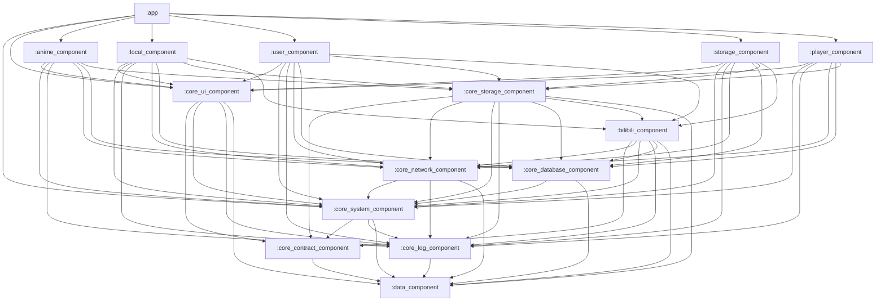

# 模块分层语义（v2）

本文件用于说明 DanDanPlayForAndroid 当前阶段的模块分层语义（v2），重点对齐 `:core_system_component` / `:core_log_component` 的职责与依赖关系。

- 依赖治理总文档：`TODOs/module_dependency_governance.md`
- 当前 Gradle 直接依赖快照：`document/architecture/module_dependencies_snapshot.md`

## 分层定义（v2）

| 分层 | 模块 | 说明 |
| --- | --- | --- |
| data | `:data_component` | 纯数据类型/枚举/DTO/Entity；不反向依赖其他模块 |
| contract | `:core_contract_component` | 跨模块契约/接口/路由与公共类型；仅依赖 data |
| runtime | `:core_system_component` `:core_log_component` | 应用运行时与启动编排（system）+ 日志/上报基础设施（log） |
| infra | `:core_network_component` `:core_database_component` `:core_storage_component` `:bilibili_component` | 可替换实现层，提供网络/数据库/存储/第三方域集成 |
| ui | `:core_ui_component` | UI 基建；不得依赖 infra 实现层 |
| feature | `:anime_component` `:local_component` `:user_component` `:storage_component` `:player_component` | 业务功能；feature 之间禁止互相依赖 |
| app | `:app` | 组合根/壳层；阶段 4 收敛跨域编排 |

## system/log 语义（DR-0001）

- `:core_system_component` 被定义为“应用运行时（runtime）/启动编排与系统能力整合”：
  - 负责 Application 级初始化编排（例如 Bugly、日志链路、ARouter、MMKV 等）
  - 提供全局配置表、系统能力封装、启动期 Hook 等
  - 允许依赖 `:core_log_component`，以保证“尽早初始化日志/崩溃上报链路”
- `:core_log_component` 被定义为“日志与上报基础设施”：
  - 只依赖 `:data_component`，避免反向依赖 `:core_system_component`
  - 由 `:core_system_component` 在启动阶段完成初始化与装配

> 若未来需要让 `:core_system_component` 回归“纯系统基建”（不依赖 log），可评估 `TODOs/module_dependency_governance.md` 中的路线 B（新增 `:core_app_component` 并迁移启动编排）。

## 目标依赖图（v2，短期）

> 本图用于表达“分层语义与推荐依赖方向”，不等同于 Gradle 直接依赖清单；直接依赖以快照文档为准。

