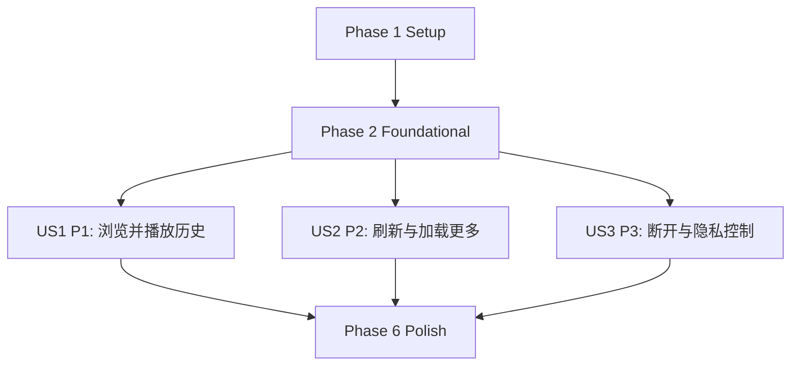

---

description: "任务清单：接入 Bilibili 历史记录媒体库（含播放偏好）"
---

# Tasks: 接入 Bilibili 历史记录媒体库（含播放偏好）

**Input**: 设计文档位于 `/home/tzw/workspace/DanDanPlayForAndroid/specs/003-add-bilibili-history/`  
**Prerequisites**:  
- `/home/tzw/workspace/DanDanPlayForAndroid/specs/003-add-bilibili-history/plan.md`（必读）  
- `/home/tzw/workspace/DanDanPlayForAndroid/specs/003-add-bilibili-history/spec.md`（必读：用户故事与验收）  
- `/home/tzw/workspace/DanDanPlayForAndroid/specs/003-add-bilibili-history/research.md`（技术决策）  
- `/home/tzw/workspace/DanDanPlayForAndroid/specs/003-add-bilibili-history/data-model.md`（数据模型）  
- `/home/tzw/workspace/DanDanPlayForAndroid/specs/003-add-bilibili-history/contracts/bilibili.openapi.yaml`（API 合约）  
- `/home/tzw/workspace/DanDanPlayForAndroid/specs/003-add-bilibili-history/quickstart.md`（快速验收路径）  

**Tests**: 本特性规范未要求 TDD/新增测试任务；本清单以“可独立验收场景 + quickstart.md 复现”为主。  

**组织方式**: 任务按用户故事拆分（US1/US2/US3），每个故事都应可独立实现与独立验收。  

## 任务格式（强制）

每条任务必须严格符合：

```text
示例（不要当成任务）: - [ ] T001 [P] [US1] 在 /home/tzw/workspace/DanDanPlayForAndroid/path/to/file 新增/修改 xxx
```

- `Txxx`：按执行顺序递增
- `[P]`：可并行（不同文件且不依赖未完成任务）
- `[USx]`：仅出现在用户故事阶段任务中（Setup/Foundational/Polish 不加）
- 描述必须包含**明确的绝对路径**

---

## Phase 1: Setup（共享初始化）

**目的**: 为后续实现准备结构与最小约束（不包含具体用户故事交付）

- [X] T001 梳理并补全 Bilibili 接入相关约束与命名（MediaType/uniqueKey 规范）到 `/home/tzw/workspace/DanDanPlayForAndroid/specs/003-add-bilibili-history/plan.md`
- [X] T002 [P] 基于 `/home/tzw/workspace/DanDanPlayForAndroid/specs/003-add-bilibili-history/contracts/bilibili.openapi.yaml` 约定好数据类命名与字段映射表，写入 `/home/tzw/workspace/DanDanPlayForAndroid/specs/003-add-bilibili-history/data-model.md`

---

## Phase 2: Foundational（阻塞性基础能力）

**目的**: 所有用户故事都依赖的底座（网络/鉴权/存储抽象/基础模型）。  
**⚠️ CRITICAL**: 未完成本阶段前，不开始 US1/US2/US3 的 UI/交互交付。

- [X] T003 [P] 新增 Bilibili API 数据模型（历史/分页/分P/playurl/二维码/导航）到 `/home/tzw/workspace/DanDanPlayForAndroid/data_component/src/main/java/com/xyoye/data_component/data/bilibili/`（新增多个 `*.kt`）
- [X] T004 [P] 新增 Bilibili 业务错误码与异常封装到 `/home/tzw/workspace/DanDanPlayForAndroid/common_component/src/main/java/com/xyoye/common_component/bilibili/error/BilibiliException.kt`
- [X] T005 [P] 新增可持久化 CookieJar（按媒体库唯一键隔离）到 `/home/tzw/workspace/DanDanPlayForAndroid/common_component/src/main/java/com/xyoye/common_component/bilibili/auth/BilibiliCookieJarStore.kt`
- [X] T006 [P] 新增 Bilibili 登录态存储（refresh_token/csrf/mid/updatedAt，支持 clear）到 `/home/tzw/workspace/DanDanPlayForAndroid/common_component/src/main/java/com/xyoye/common_component/bilibili/auth/BilibiliAuthStore.kt`
- [X] T007 [P] 新增 Bilibili 请求头策略（User-Agent/Referer/Accept-Encoding/Cookie，且日志脱敏）到 `/home/tzw/workspace/DanDanPlayForAndroid/common_component/src/main/java/com/xyoye/common_component/bilibili/net/BilibiliHeaders.kt`
- [X] T008 [P] 新增 WBI key 缓存与签名实现到 `/home/tzw/workspace/DanDanPlayForAndroid/common_component/src/main/java/com/xyoye/common_component/bilibili/wbi/BilibiliWbiSigner.kt`
- [X] T009 [P] 新增 Bilibili Retrofit Service 定义（按 HeaderKey.BASE_URL 动态切域名）到 `/home/tzw/workspace/DanDanPlayForAndroid/common_component/src/main/java/com/xyoye/common_component/network/service/BilibiliService.kt`
- [X] T010 将 Bilibili Retrofit client 挂载到 `/home/tzw/workspace/DanDanPlayForAndroid/common_component/src/main/java/com/xyoye/common_component/network/Retrofit.kt`（新增 `bilibiliService`，使用专用 OkHttpClient + CookieJarStore + 解压拦截器）
- [X] T011 [P] 新增 Bilibili Repository（二维码登录/历史/分P/playurl/nav/wbi key/cookie refresh）到 `/home/tzw/workspace/DanDanPlayForAndroid/common_component/src/main/java/com/xyoye/common_component/bilibili/repository/BilibiliRepository.kt`
- [X] T012 [P] 新增 Bilibili uniqueKey 解析与构造（`bilibili://archive/{bvid}?cid={cid}`）到 `/home/tzw/workspace/DanDanPlayForAndroid/common_component/src/main/java/com/xyoye/common_component/bilibili/BilibiliKeys.kt`
- [X] T013 [P] 新增 DASH MPD 生成器（把 playurl.dash 音视频轨写为本地 `.mpd`）到 `/home/tzw/workspace/DanDanPlayForAndroid/common_component/src/main/java/com/xyoye/common_component/bilibili/mpd/BilibiliMpdGenerator.kt`
- [X] T014 [P] 新增 Bilibili StorageFile 实现（目录/文件、cover、duration、child count、uniqueKey、getFile() 返回原始模型）到 `/home/tzw/workspace/DanDanPlayForAndroid/common_component/src/main/java/com/xyoye/common_component/storage/file/impl/BilibiliStorageFile.kt`
- [X] T015 新增 BilibiliStorage（实现 `getRootFile/openDirectory/pathFile/historyFile/createPlayUrl/getNetworkHeaders/test/close`）到 `/home/tzw/workspace/DanDanPlayForAndroid/common_component/src/main/java/com/xyoye/common_component/storage/impl/BilibiliStorage.kt`
- [X] T016 将 `MediaType.BILIBILI_STORAGE` 接入 StorageFactory 到 `/home/tzw/workspace/DanDanPlayForAndroid/common_component/src/main/java/com/xyoye/common_component/storage/StorageFactory.kt`

**Checkpoint**: 基础能力就绪——可以开始按用户故事交付 UI/交互与验收闭环

---

## Phase 3: User Story 1 - 浏览并播放历史记录 (Priority: P1) 🎯 MVP

**Goal**: 支持“连接账号 → 浏览历史 → 点击条目续播/播放 → 自动加载官方弹幕（按 cid）”。  
**Independent Test**: 按 `/home/tzw/workspace/DanDanPlayForAndroid/specs/003-add-bilibili-history/spec.md` 的 US1 验收场景 1~6 逐条验证。

### Implementation for User Story 1

- [X] T017 [P] [US1] 抽取通用二维码生成工具（供 Bilibili 登录复用）到 `/home/tzw/workspace/DanDanPlayForAndroid/common_component/src/main/java/com/xyoye/common_component/utils/QrCodeHelper.kt` 并改造 `/home/tzw/workspace/DanDanPlayForAndroid/storage_component/src/main/java/com/xyoye/storage_component/ui/activities/screencast/receiver/ScreencastActivity.kt`
- [X] T018 [P] [US1] 新增 Bilibili 扫码登录弹窗 UI（显示二维码/状态/取消/重试）到 `/home/tzw/workspace/DanDanPlayForAndroid/storage_component/src/main/java/com/xyoye/storage_component/ui/dialog/BilibiliLoginDialog.kt` 与 `/home/tzw/workspace/DanDanPlayForAndroid/storage_component/src/main/res/layout/dialog_bilibili_login.xml`
- [X] T019 [US1] 在未连接/连接失效时拦截 Bilibili 目录加载并弹出登录引导（不要展示个人历史数据）到 `/home/tzw/workspace/DanDanPlayForAndroid/storage_component/src/main/java/com/xyoye/storage_component/ui/fragment/storage_file/StorageFileFragmentViewModel.kt` 与 `/home/tzw/workspace/DanDanPlayForAndroid/storage_component/src/main/java/com/xyoye/storage_component/ui/fragment/storage_file/StorageFileFragment.kt`
- [X] T020 [US1] 在 BilibiliStorage 中实现根目录结构与“历史记录”入口 `/history/` 到 `/home/tzw/workspace/DanDanPlayForAndroid/common_component/src/main/java/com/xyoye/common_component/storage/impl/BilibiliStorage.kt`
- [X] T021 [US1] 在 BilibiliStorage 中实现历史记录列表拉取与过滤（`type=archive` + `business` 二次过滤 + cid/bvid 校验）到 `/home/tzw/workspace/DanDanPlayForAndroid/common_component/src/main/java/com/xyoye/common_component/storage/impl/BilibiliStorage.kt`
- [X] T022 [US1] 将历史条目的远端进度/时长/view_at 映射为“临时播放历史”用于列表展示与首次续播（不落库）到 `/home/tzw/workspace/DanDanPlayForAndroid/storage_component/src/main/java/com/xyoye/storage_component/ui/fragment/storage_file/StorageFileFragmentViewModel.kt`
- [X] T023 [US1] 在 BilibiliStorage 中实现多 P 条目的目录展开（`videos>1` → pagelist → 每个 cid 作为文件项）到 `/home/tzw/workspace/DanDanPlayForAndroid/common_component/src/main/java/com/xyoye/common_component/storage/impl/BilibiliStorage.kt`
- [X] T024 [US1] 在 BilibiliStorage 中实现 `createPlayUrl()`：按偏好请求 playurl（DASH 优先，失败回退 MP4），并为 DASH 生成本地 `.mpd` 到 `/home/tzw/workspace/DanDanPlayForAndroid/common_component/src/main/java/com/xyoye/common_component/storage/impl/BilibiliStorage.kt`
- [X] T025 [US1] 在 BilibiliStorage 中实现 `getNetworkHeaders()`：注入 Cookie/Referer/User-Agent，并确保日志不输出敏感 Cookie 到 `/home/tzw/workspace/DanDanPlayForAndroid/common_component/src/main/java/com/xyoye/common_component/storage/impl/BilibiliStorage.kt`
- [X] T026 [P] [US1] 新增 Bilibili 官方弹幕下载与稳定落盘（`bilibili_{cid}.xml`）到 `/home/tzw/workspace/DanDanPlayForAndroid/common_component/src/main/java/com/xyoye/common_component/bilibili/danmaku/BilibiliDanmakuDownloader.kt`
- [X] T027 [US1] 在播放器自动匹配弹幕时对 `MediaType.BILIBILI_STORAGE` 分流：解析 cid → 下载/缓存 → 自动加载（失败不影响播放）到 `/home/tzw/workspace/DanDanPlayForAndroid/player_component/src/main/java/com/xyoye/player_component/ui/activities/player/PlayerDanmuViewModel.kt`
- [ ] T028 [US1] 校验播放失败提示可理解且可恢复（下架/权限/区域限制等），并确保可返回列表继续选择到 `/home/tzw/workspace/DanDanPlayForAndroid/storage_component/src/main/java/com/xyoye/storage_component/ui/activities/storage_file/StorageFileViewModel.kt`

**Checkpoint**: US1 MVP 闭环完成——“连接→历史→播放→弹幕”可独立验收

---

## Phase 4: User Story 2 - 可用的刷新与加载更多 (Priority: P2)

**Goal**: 历史记录长列表具备刷新/分页/失败反馈，并在手机与 TV 场景都可操作。  
**Independent Test**: 仅通过“首次进入加载 → 下拉刷新 → 上拉/按钮加载更多 → 断网/重连重试”验证（不依赖播放）。

### Implementation for User Story 2

- [X] T029 [P] [US2] 为可分页媒体库抽象分页能力接口（如 `PagedStorage`：reset/loadMore/hasMore/state）到 `/home/tzw/workspace/DanDanPlayForAndroid/common_component/src/main/java/com/xyoye/common_component/storage/PagedStorage.kt`
- [X] T030 [US2] 让 BilibiliStorage 实现分页接口并维护 cursor（max/view_at/business/ps），支持 refresh 重置到 `/home/tzw/workspace/DanDanPlayForAndroid/common_component/src/main/java/com/xyoye/common_component/storage/impl/BilibiliStorage.kt`
- [X] T031 [US2] 在文件浏览页增加“下拉刷新”（触屏）并调用 `listFile(refresh=true)` 到 `/home/tzw/workspace/DanDanPlayForAndroid/storage_component/src/main/res/layout/fragment_storage_file.xml` 与 `/home/tzw/workspace/DanDanPlayForAndroid/storage_component/src/main/java/com/xyoye/storage_component/ui/fragment/storage_file/StorageFileFragment.kt`
- [X] T032 [US2] 增加“加载更多/重试/无更多”的可聚焦入口（TV）并与分页状态联动到 `/home/tzw/workspace/DanDanPlayForAndroid/storage_component/src/main/java/com/xyoye/storage_component/ui/fragment/storage_file/StorageFileAdapter.kt` 与 `/home/tzw/workspace/DanDanPlayForAndroid/storage_component/src/main/java/com/xyoye/storage_component/ui/fragment/storage_file/StorageFileFragmentViewModel.kt`
- [X] T033 [US2] 在 `StorageFileFragmentViewModel` 中实现 loadMore：追加到现有列表、去重、并在失败时保持已加载内容可浏览到 `/home/tzw/workspace/DanDanPlayForAndroid/storage_component/src/main/java/com/xyoye/storage_component/ui/fragment/storage_file/StorageFileFragmentViewModel.kt`
- [X] T034 [US2] 针对弱网/断网避免“无限加载”：为分页请求增加超时/错误码提示与重试路径到 `/home/tzw/workspace/DanDanPlayForAndroid/common_component/src/main/java/com/xyoye/common_component/bilibili/repository/BilibiliRepository.kt`

**Checkpoint**: US2 可独立验收——刷新/加载更多/失败反馈在手机与 TV 均可用

---

## Phase 5: User Story 3 - 账号断开与隐私控制 (Priority: P3)

**Goal**: 支持断开连接并清除与该媒体库相关的隐私数据；播放中清除需立即退出播放。  
**Independent Test**: “断开前可见历史 → 断开后不可见 → 重新连接后恢复访问”，并覆盖“播放中断开立即退出”。

### Implementation for User Story 3

- [X] T035 [P] [US3] 新增“清理某媒体库的播放历史/进度”DAO 方法到 `/home/tzw/workspace/DanDanPlayForAndroid/common_component/src/main/java/com/xyoye/common_component/database/dao/PlayHistoryDao.kt`
- [X] T036 [P] [US3] 新增 Bilibili 清理器：清理 auth/cookie、播放偏好、历史缓存（若有）、并删除该 storageId 关联的弹幕缓存文件到 `/home/tzw/workspace/DanDanPlayForAndroid/common_component/src/main/java/com/xyoye/common_component/bilibili/cleanup/BilibiliCleanup.kt`
- [X] T037 [P] [US3] 新增“退出播放器”的广播 Action 常量与发送工具到 `/home/tzw/workspace/DanDanPlayForAndroid/common_component/src/main/java/com/xyoye/common_component/config/PlayerActions.kt`
- [X] T038 [US3] 在 PlayerActivity 注册广播接收：若正在播放 `MediaType.BILIBILI_STORAGE` 且 storageId 命中则立即停止并 finish 到 `/home/tzw/workspace/DanDanPlayForAndroid/player_component/src/main/java/com/xyoye/player_component/ui/activities/player/PlayerActivity.kt`
- [X] T039 [US3] 在 Bilibili 媒体库编辑弹窗增加“断开连接并清除数据”入口，并调用清理器+发送退出播放器广播到 `/home/tzw/workspace/DanDanPlayForAndroid/storage_component/src/main/java/com/xyoye/storage_component/ui/dialog/BilibiliStorageEditDialog.kt`
- [X] T040 [US3] 清理后确保入口回到未连接态（进入时提示登录且不展示个人历史）到 `/home/tzw/workspace/DanDanPlayForAndroid/common_component/src/main/java/com/xyoye/common_component/storage/impl/BilibiliStorage.kt`

**Checkpoint**: US3 可独立验收——断开/清理/播放中断开均符合隐私与可控性要求

---

## Phase 6: Polish & Cross-Cutting Concerns

**目的**: 跨故事的体验/稳定性/性能/可维护性补齐

- [ ] T041 [P] 文案与可达性优化：TV 焦点可达、操作提示清晰（登录/加载更多/失败）到 `/home/tzw/workspace/DanDanPlayForAndroid/storage_component/src/main/java/com/xyoye/storage_component/ui/fragment/storage_file/StorageFileFragment.kt`
- [X] T042 [P] 日志脱敏：确保 Bilibili Cookie/refresh_token 不会被 LoggerInterceptor 打印到 `/home/tzw/workspace/DanDanPlayForAndroid/common_component/src/main/java/com/xyoye/common_component/network/helper/LoggerInterceptor.kt`
- [ ] T043 [P] 可选：实现 Cookie 刷新链路（info → correspond → refresh → confirm/refresh），并在 -101 或即将过期时触发到 `/home/tzw/workspace/DanDanPlayForAndroid/common_component/src/main/java/com/xyoye/common_component/bilibili/repository/BilibiliRepository.kt`
- [ ] T044 [P] 可选：历史记录首屏缓存（内存/本地）以提高 SC-001 命中率，并在刷新时展示旧数据到 `/home/tzw/workspace/DanDanPlayForAndroid/common_component/src/main/java/com/xyoye/common_component/bilibili/repository/BilibiliRepository.kt`
- [ ] T045 逐条跑通 quickstart 验收清单并补充差异说明到 `/home/tzw/workspace/DanDanPlayForAndroid/specs/003-add-bilibili-history/quickstart.md`

---

## Dependencies & Execution Order（依赖与完成顺序）

### 依赖图（用户故事完成顺序）



- Setup → Foundational 为硬依赖（阻塞）
- US1/US2/US3 均依赖 Foundational；其中 US2/US3 可在 US1 完成后再做，也可并行推进（视人力）

---

## Parallel Examples（并行示例）

### US1 并行示例

```text
可并行：
- T017（抽取 QrCodeHelper）与 T026（BilibiliDanmakuDownloader）
- T018（登录弹窗 UI）与 T020（根目录/历史入口）
需要串行：
- T024（createPlayUrl）依赖 Phase 2 的 T008/T011/T013
```

### US2 并行示例

```text
可并行：
- T031（下拉刷新 UI）与 T029（分页接口抽象）
需要串行：
- T033（loadMore 追加逻辑）依赖 T029/T030
```

### US3 并行示例

```text
可并行：
- T035（PlayHistoryDao 清理方法）与 T037（PlayerActions 常量）
需要串行：
- T039（断开清除入口）依赖 T036/T037/T038
```

---

## Implementation Strategy（实施策略）

### MVP 优先（只做 US1）

1. 完成 Phase 1 + Phase 2
2. 完成 Phase 3（US1）并按 `/home/tzw/workspace/DanDanPlayForAndroid/specs/003-add-bilibili-history/spec.md` 验收 US1
3. 若 US1 闭环稳定，再进入 US2/US3

### 增量交付

1. Foundation ready
2. US1 → 独立验收 → Demo
3. US2 → 独立验收 → Demo
4. US3 → 独立验收 → Demo
5. Polish（跨故事）
